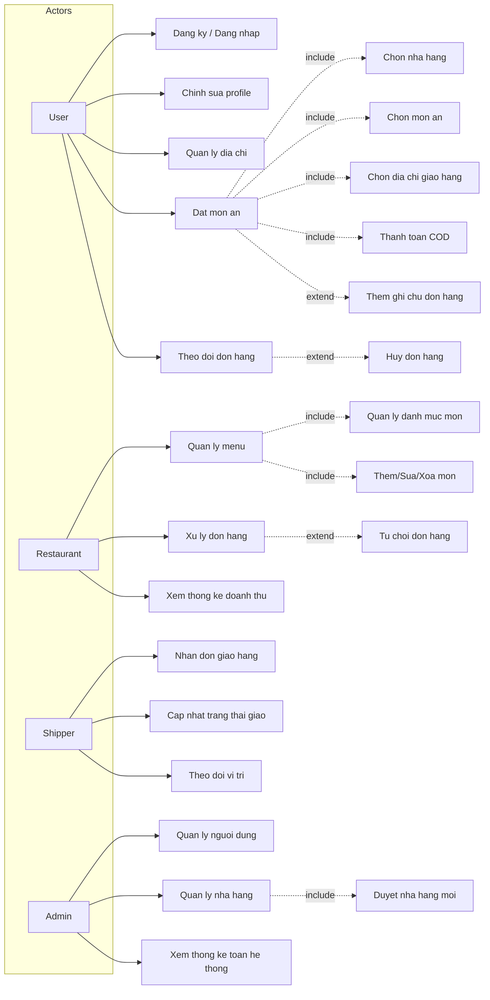
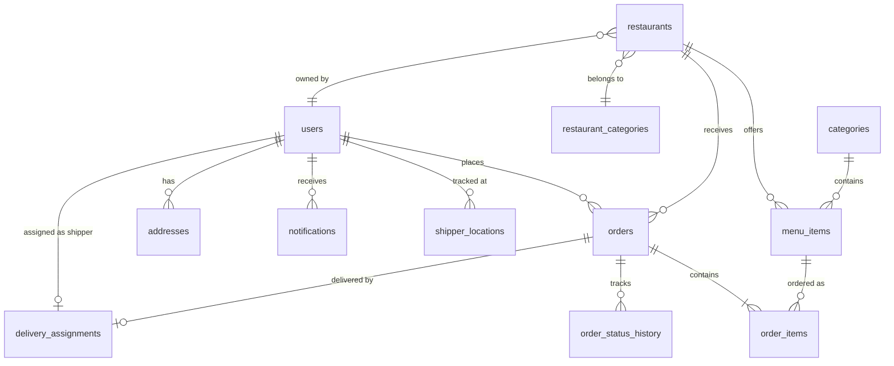
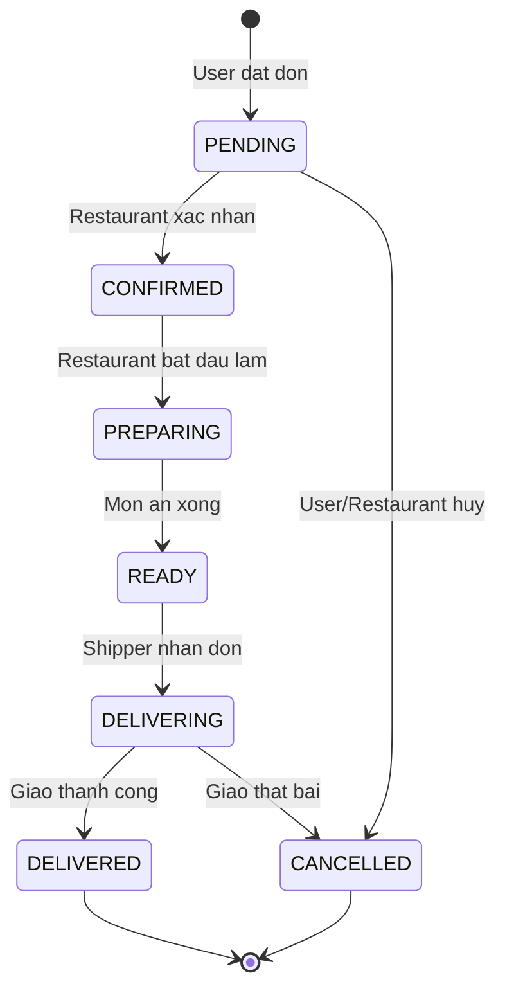

# Database Schema Design - Mini Food Delivery

## Actors & Use Cases tổng quan

## Danh sach cac bang (12 bang)

1. **users** - Tat ca nguoi dung (user, shipper, restaurant_owner, admin)
2. **restaurants** - Thong tin nha hang
3. **categories** - Danh muc mon an (Tra sua, Com, Bun, ...)
4. **menu_items** - Mon an trong menu nha hang
5. **orders** - Don hang
6. **order_items** - Chi tiet tung mon trong don hang
7. **order_status_history** - Lich su trang thai don hang (theo doi realtime)
8. **delivery_assignments** - Phan cong shipper giao hang
9. **shipper_locations** - Vi tri realtime cua shipper
10. **notifications** - Thong bao cho nguoi dung
11. **restaurant_categories** - Loai nha hang (Do An Nhanh, Tra Sua, ...)
12. **addresses** - Dia chi giao hang cua user

## Entity Relationship Diagram

## Chi tiet tung bang

### 1. users

| Column     | Type         | Constraint                              |
| ---------- | ------------ | --------------------------------------- |
| id         | BIGINT       | PK, AUTO_INCREMENT                      |
| email      | VARCHAR(255) | NOT NULL, UNIQUE                        |
| password   | VARCHAR(255) | NOT NULL                                |
| full_name  | VARCHAR(100) | NOT NULL                                |
| phone      | VARCHAR(15)  | UNIQUE                                  |
| avatar_url | VARCHAR(500) |                                         |
| role       | VARCHAR(50)  | NOT NULL, DEFAULT 'USER'                |
| is_active  | BOOLEAN      | NOT NULL, DEFAULT TRUE                  |
| is_deleted | BOOLEAN      | NOT NULL, DEFAULT FALSE                 |
| created_at | TIMESTAMP    | DEFAULT CURRENT_TIMESTAMP               |
| updated_at | TIMESTAMP    | DEFAULT CURRENT_TIMESTAMP ON UPDATE CURRENT_TIMESTAMP |

- **Index:** `idx_users_role_active` ON (role, is_active)
- **Engine:** InnoDB

### 2. addresses

| Column       | Type          | Constraint                   |
| ------------ | ------------- | ---------------------------- |
| id           | BIGINT        | PK, AUTO_INCREMENT           |
| user_id      | BIGINT        | NOT NULL, FK -> users.id     |
| label        | VARCHAR(50)   | (Nha, Co quan, ...)          |
| address_line | VARCHAR(500)  | NOT NULL                     |
| latitude     | DECIMAL(10,8) |                              |
| longitude    | DECIMAL(11,8) |                              |
| is_default   | BOOLEAN       | NOT NULL, DEFAULT FALSE      |

- **FK:** `fk_addresses_user` (user_id) REFERENCES users(id) ON DELETE CASCADE
- **Index:** `idx_addresses_user` ON (user_id)
- **Engine:** InnoDB

### 3. restaurant_categories

| Column   | Type         | Constraint         |
| -------- | ------------ | ------------------ |
| id       | BIGINT       | PK, AUTO_INCREMENT |
| name     | VARCHAR(100) | NOT NULL, UNIQUE   |
| icon_url | VARCHAR(500) |                    |

- **Engine:** InnoDB

### 4. restaurants

| Column       | Type          | Constraint                              |
| ------------ | ------------- | --------------------------------------- |
| id           | BIGINT        | PK, AUTO_INCREMENT                      |
| owner_id     | BIGINT        | NOT NULL, FK -> users.id                |
| category_id  | BIGINT        | FK -> restaurant_categories.id          |
| name         | VARCHAR(200)  | NOT NULL                                |
| description  | TEXT          |                                         |
| phone        | VARCHAR(15)   |                                         |
| address      | VARCHAR(500)  | NOT NULL                                |
| latitude     | DECIMAL(10,8) |                                         |
| longitude    | DECIMAL(11,8) |                                         |
| image_url    | VARCHAR(500)  |                                         |
| opening_time | TIME          |                                         |
| closing_time | TIME          |                                         |
| is_open      | BOOLEAN       | DEFAULT TRUE                            |
| is_approved  | BOOLEAN       | DEFAULT FALSE                           |
| is_deleted   | BOOLEAN       | DEFAULT FALSE                           |
| created_at   | TIMESTAMP     | DEFAULT CURRENT_TIMESTAMP               |
| updated_at   | TIMESTAMP     | DEFAULT CURRENT_TIMESTAMP ON UPDATE CURRENT_TIMESTAMP |

- **FK:** `fk_restaurants_owner` (owner_id) REFERENCES users(id)
- **FK:** `fk_restaurants_category` (category_id) REFERENCES restaurant_categories(id)
- **Index:** `idx_restaurants_owner` ON (owner_id)
- **Index:** `idx_restaurants_category` ON (category_id)
- **Index:** `idx_restaurants_approved` ON (is_approved)
- **Engine:** InnoDB

### 5. categories (danh muc mon an)

| Column        | Type         | Constraint                   |
| ------------- | ------------ | ---------------------------- |
| id            | BIGINT       | PK, AUTO_INCREMENT           |
| restaurant_id | BIGINT       | NOT NULL, FK -> restaurants.id |
| name          | VARCHAR(100) | NOT NULL                     |
| sort_order    | INT          | DEFAULT 0                    |

- **FK:** `fk_categories_restaurant` (restaurant_id) REFERENCES restaurants(id) ON DELETE CASCADE
- **Index:** `idx_categories_restaurant` ON (restaurant_id)
- **Engine:** InnoDB

### 6. menu_items

| Column        | Type          | Constraint                              |
| ------------- | ------------- | --------------------------------------- |
| id            | BIGINT        | PK, AUTO_INCREMENT                      |
| restaurant_id | BIGINT        | NOT NULL, FK -> restaurants.id          |
| category_id   | BIGINT        | FK -> categories.id                     |
| name          | VARCHAR(200)  | NOT NULL                                |
| description   | TEXT          |                                         |
| price         | DECIMAL(12,2) | NOT NULL, CHECK (price >= 0)            |
| image_url     | VARCHAR(500)  |                                         |
| is_available  | BOOLEAN       | DEFAULT TRUE                            |
| is_deleted    | BOOLEAN       | DEFAULT FALSE                           |
| created_at    | TIMESTAMP     | DEFAULT CURRENT_TIMESTAMP               |
| updated_at    | TIMESTAMP     | DEFAULT CURRENT_TIMESTAMP ON UPDATE CURRENT_TIMESTAMP |

- **FK:** `fk_menu_items_restaurant` (restaurant_id) REFERENCES restaurants(id) ON DELETE CASCADE
- **FK:** `fk_menu_items_category` (category_id) REFERENCES categories(id) ON DELETE SET NULL
- **CHECK:** `chk_menu_items_price` (price >= 0)
- **Index:** `idx_menu_items_restaurant` ON (restaurant_id)
- **Index:** `idx_menu_items_category` ON (category_id)
- **Engine:** InnoDB

### 7. orders

| Column           | Type          | Constraint                              |
| ---------------- | ------------- | --------------------------------------- |
| id               | BIGINT        | PK, AUTO_INCREMENT                      |
| user_id          | BIGINT        | NOT NULL, FK -> users.id                |
| restaurant_id    | BIGINT        | NOT NULL, FK -> restaurants.id          |
| delivery_address | VARCHAR(500)  | NOT NULL                                |
| delivery_lat     | DECIMAL(10,8) |                                         |
| delivery_lng     | DECIMAL(11,8) |                                         |
| subtotal         | DECIMAL(12,2) | NOT NULL, CHECK (>= 0)                  |
| delivery_fee     | DECIMAL(12,2) | NOT NULL, DEFAULT 0, CHECK (>= 0)       |
| total_amount     | DECIMAL(12,2) | NOT NULL, CHECK (>= 0)                  |
| payment_method   | VARCHAR(50)   | NOT NULL, DEFAULT 'COD'                 |
| status           | VARCHAR(50)   | NOT NULL, DEFAULT 'PENDING'             |
| note             | VARCHAR(500)  |                                         |
| created_at       | TIMESTAMP     | DEFAULT CURRENT_TIMESTAMP               |
| updated_at       | TIMESTAMP     | DEFAULT CURRENT_TIMESTAMP ON UPDATE CURRENT_TIMESTAMP |

- **FK:** `fk_orders_user` (user_id) REFERENCES users(id)
- **FK:** `fk_orders_restaurant` (restaurant_id) REFERENCES restaurants(id)
- **CHECK:** `chk_orders_subtotal` (subtotal >= 0)
- **CHECK:** `chk_orders_fee` (delivery_fee >= 0)
- **CHECK:** `chk_orders_total` (total_amount >= 0)
- **Index:** `idx_orders_user` ON (user_id)
- **Index:** `idx_orders_status` ON (status)
- **Index:** `idx_orders_user_time` ON (user_id, created_at)
- **Engine:** InnoDB
- **Trang thai hop le:** PENDING, CONFIRMED, PREPARING, READY, DELIVERING, DELIVERED, CANCELLED

### 8. order_items

| Column       | Type          | Constraint                        |
| ------------ | ------------- | --------------------------------- |
| id           | BIGINT        | PK, AUTO_INCREMENT                |
| order_id     | BIGINT        | NOT NULL, FK -> orders.id         |
| menu_item_id | BIGINT        | FK -> menu_items.id               |
| item_name    | VARCHAR(200)  | NOT NULL (snapshot)               |
| item_price   | DECIMAL(12,2) | NOT NULL (snapshot), CHECK (>= 0) |
| quantity     | INT           | NOT NULL, CHECK (> 0)             |
| subtotal     | DECIMAL(12,2) | NOT NULL, CHECK (>= 0)            |
| note         | VARCHAR(500)  |                                   |

- **FK:** `fk_order_items_order` (order_id) REFERENCES orders(id) ON DELETE CASCADE
- **FK:** `fk_order_items_menu_item` (menu_item_id) REFERENCES menu_items(id) ON DELETE SET NULL
- **CHECK:** `chk_order_items_quantity` (quantity > 0)
- **CHECK:** `chk_order_items_price` (item_price >= 0)
- **CHECK:** `chk_order_items_subtotal` (subtotal >= 0)
- **Index:** `idx_order_items_order` ON (order_id)
- **Engine:** InnoDB

### 9. order_status_history

| Column     | Type         | Constraint                |
| ---------- | ------------ | ------------------------- |
| id         | BIGINT       | PK, AUTO_INCREMENT        |
| order_id   | BIGINT       | NOT NULL, FK -> orders.id |
| status     | VARCHAR(50)  | NOT NULL                  |
| changed_by | BIGINT       | FK -> users.id            |
| note       | VARCHAR(500) |                           |
| created_at | TIMESTAMP    | DEFAULT CURRENT_TIMESTAMP |

- **FK:** `fk_order_status_history_order` (order_id) REFERENCES orders(id) ON DELETE CASCADE
- **FK:** `fk_order_status_history_user` (changed_by) REFERENCES users(id) ON DELETE SET NULL
- **Index:** `idx_order_status_history_order` ON (order_id)
- **Engine:** InnoDB

### 10. delivery_assignments

| Column       | Type         | Constraint                    |
| ------------ | ------------ | ----------------------------- |
| id           | BIGINT       | PK, AUTO_INCREMENT            |
| order_id     | BIGINT       | NOT NULL, UNIQUE, FK -> orders.id |
| shipper_id   | BIGINT       | NOT NULL, FK -> users.id      |
| status       | VARCHAR(50)  | NOT NULL, DEFAULT 'UNASSIGNED' |
| picked_up_at | TIMESTAMP    | NULL                          |
| delivered_at | TIMESTAMP    | NULL                          |
| created_at   | TIMESTAMP    | DEFAULT CURRENT_TIMESTAMP     |

- **FK:** `fk_delivery_assignments_order` (order_id) REFERENCES orders(id)
- **FK:** `fk_delivery_assignments_shipper` (shipper_id) REFERENCES users(id)
- **Index:** `idx_delivery_shipper` ON (shipper_id)
- **Engine:** InnoDB

### 11. shipper_locations

| Column     | Type          | Constraint                              |
| ---------- | ------------- | --------------------------------------- |
| id         | BIGINT        | PK, AUTO_INCREMENT                      |
| shipper_id | BIGINT        | NOT NULL, UNIQUE, FK -> users.id        |
| latitude   | DECIMAL(10,8) | NOT NULL                                |
| longitude  | DECIMAL(11,8) | NOT NULL                                |
| is_online  | BOOLEAN       | DEFAULT FALSE                           |
| updated_at | TIMESTAMP     | DEFAULT CURRENT_TIMESTAMP ON UPDATE CURRENT_TIMESTAMP |

- **FK:** `fk_shipper_locations_shipper` (shipper_id) REFERENCES users(id) ON DELETE CASCADE
- **Engine:** InnoDB

### 12. notifications

| Column     | Type         | Constraint                |
| ---------- | ------------ | ------------------------- |
| id         | BIGINT       | PK, AUTO_INCREMENT        |
| user_id    | BIGINT       | NOT NULL, FK -> users.id  |
| title      | VARCHAR(200) | NOT NULL                  |
| message    | TEXT         | NOT NULL                  |
| type       | VARCHAR(50)  | NOT NULL                  |
| is_read    | BOOLEAN      | DEFAULT FALSE             |
| created_at | TIMESTAMP    | DEFAULT CURRENT_TIMESTAMP |

- **FK:** `fk_notifications_user` (user_id) REFERENCES users(id) ON DELETE CASCADE
- **Index:** `idx_notifications_user` ON (user_id)
- **Index:** `idx_notifications_time` ON (created_at)
- **Engine:** InnoDB

## Flow don hang chinh

## Diem thiet ke dang chu y

- **Dung VARCHAR thay ENUM** cho role, status, type, payment_method de linh hoat mo rong ma khong can ALTER TABLE
- **Soft delete** (`is_deleted`) cho users, restaurants, menu_items - khong xoa du lieu that, chi danh dau
- **order_items** luu snapshot (item_name, item_price) de don hang khong bi anh huong khi nha hang doi gia/ten mon
- **order_status_history** ghi lai toan bo lich su trang thai de theo doi realtime va thong ke
- **users** dung 1 bang chung voi cot `role` (de don gian voi Spring Security)
- **categories** thuoc ve tung restaurant (moi nha hang co danh muc rieng)
- **delivery_assignments** tach rieng de quan ly shipper doc lap voi order
- **shipper_locations** luu vi tri moi nhat cua shipper (1 record/shipper, cap nhat lien tuc)
- **CHECK constraints** cho gia tri tien (price, subtotal, delivery_fee, total_amount >= 0) va so luong (quantity > 0)
- **Indexes** toi uu cho cac truy van thuong dung (theo user, status, thoi gian)
- **Database:** `mini_food_delivery`, charset `utf8mb4_unicode_ci`, engine `InnoDB`

## Trang thai hien tai cua project

### Backend (Spring Boot)
- **Framework:** Spring Boot 3.5.13, Java 17
- **Dependencies da cai:** spring-boot-starter-data-jpa, mysql-connector-j, lombok, jjwt 0.13.0, jacoco
- **12 JPA Entity classes** da tao trong `SRC/backend/src/main/java/com/example/server/entity/`
- **application.yaml** da cau hinh ket noi MySQL (ddl-auto: update)
- **Chua co:** Controller, Service, Repository, DTO, Config, Security, Exception handler

### Frontend (Vue.js)
- **Framework:** Vue 3.5 + Vite 8 + Vue Router 5 + Pinia 3
- **Trang thai:** Da scaffold, chua co pages/components cu the

### Database
- **SQL schema:** `Documents Software Analysis and Design/Design/schema.sql` (233 dong, 12 bang)
- **ERD diagram:** `Documents Software Analysis and Design/Design/image.png`

## Ghi chu can xu ly

- **Database name khong thong nhat:** `application.yaml` dung `mini_food_db` nhung `schema.sql` dung `mini_food_delivery` --> can sua cho khop
- **Thieu dependencies trong pom.xml:** can them `spring-boot-starter-web` (REST API) va `spring-boot-starter-security` (authentication)

## Buoc tiep theo

1. Thong nhat database name giua `application.yaml` va `schema.sql`
2. Them `spring-boot-starter-web` va `spring-boot-starter-security` vao `pom.xml`
3. Tao Repository interfaces (JPA) cho 12 entity
4. Tao DTO classes (request/response)
5. Tao Service layer (business logic)
6. Tao Controller layer (REST API)
7. Cau hinh Security (JWT authentication)
8. Tao Exception handler