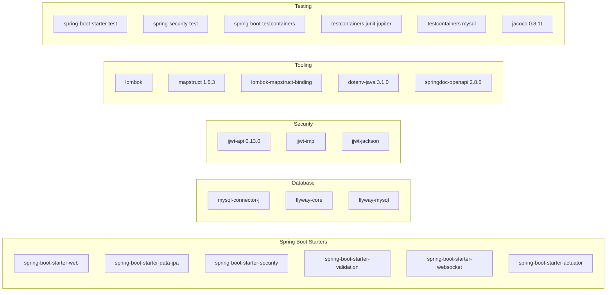

# 🏗️ BACKEND DEEP-DIVE — MỤC LỤC & TỔNG QUAN

> **Phạm vi:** Phân tích chi tiết kiến trúc Backend — Spring Boot 3.5.13 / Java 17  
> **Cập nhật:** 11/05/2026 · v2.0  
> **Package gốc:** `com.example.server`

---

## 📑 MỤC LỤC PHÂN TÍCH BACKEND

| # | Tài liệu | Nội dung chính |
|:-:|:---------|:--------------|
| 1 | [Kiến trúc & Cấu hình](./01_architecture_config.md) | Layered Architecture, Spring Profiles, CORS, WebSocket, OpenAPI |
| 2 | [Bảo mật & Xác thực](./02_security_auth.md) | JWT flow, RBAC, SecurityFilterChain, Error Handling |
| 3 | [Mô hình Dữ liệu](./03_data_model.md) | 14 JPA Entities, ERD, Flyway Migrations, Snapshot Pattern |
| 4 | [Tầng Logic Nghiệp vụ](./04_business_logic.md) | 12 Services, Event-Driven, State Machine, Delivery Fee |
| 5 | [REST API & WebSocket](./05_api_surface.md) | 13 Controllers, 60+ endpoints, STOMP real-time |
| 6 | [Data Access & Mapping](./06_data_access.md) | 14 Repositories, MapStruct Mappers, JPQL/Native queries |

---

## 🔢 THỐNG KÊ MÃ NGUỒN

```
com.example.server/
├── ServerApplication.java          ← Entry point + Dotenv + Smoke Mode
├── config/          (5 classes)    ← SecurityConfig, WebSocket, OpenAPI, CORS, RestClient
├── controller/      (13 classes)   ← 12 REST + 1 WebSocket controller
├── dto/             (11 packages)  ← Request/Response DTOs, organized by domain
├── entity/          (14 classes)   ← JPA entities (includes ShipperRequest)
├── enums/           (6 enums)      ← Role, OrderStatus, DeliveryAssignmentStatus, etc.
├── event/           (1 class)      ← OrderReadyEvent
├── exception/       (3 classes)    ← AppException, ResourceNotFound, GlobalHandler
├── listener/        (1 class)      ← OrderEventListener
├── mapper/          (7 interfaces) ← MapStruct mapper interfaces
├── repository/      (14 interfaces)← Spring Data JPA repositories
├── security/        (4 classes)    ← JWT utilities, auth filter, UserDetails
└── service/         (12+12 files)  ← 12 interfaces + 12 implementations
```

> [!TIP]
> Tổng cộng khoảng **100+ Java source files** được tổ chức theo **12 packages** theo mô hình phân tầng.

## 🧩 DEPENDENCY MAP



## ⚙️ BUILD PIPELINE

```
pom.xml
├── Java 17 (source + target)
├── spring-boot-maven-plugin
│   └── excludes: lombok (not needed at runtime)
├── maven-compiler-plugin
│   └── annotationProcessorPaths:
│       ├── lombok              (1st — must run before mapstruct)
│       ├── lombok-mapstruct-binding 0.2.0
│       └── mapstruct-processor 1.6.3
└── jacoco-maven-plugin 0.8.11
    ├── prepare-agent (before tests)
    └── report        (after tests, phase=test)
```

> [!IMPORTANT]
> Thứ tự annotation processor **rất quan trọng**: Lombok phải chạy trước MapStruct để các getter/setter được generate trước khi MapStruct tạo mapper implementations.
