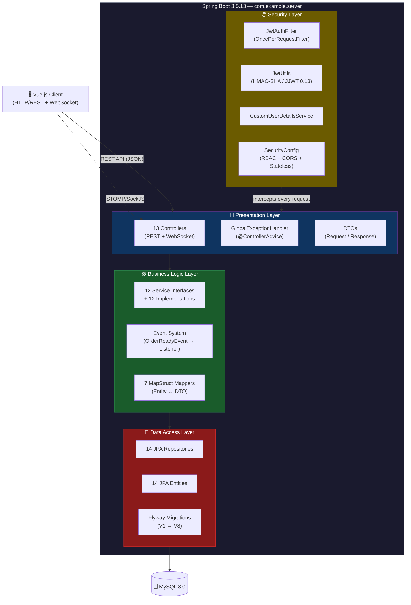
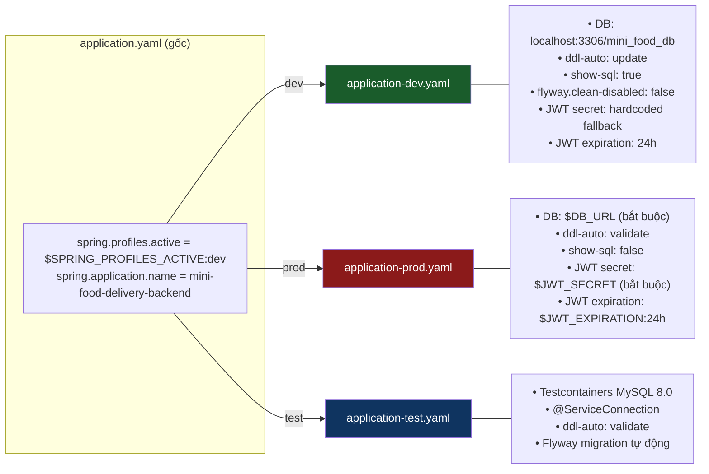
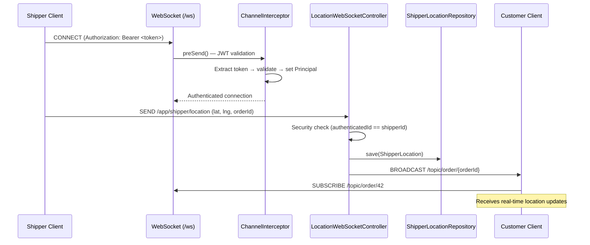
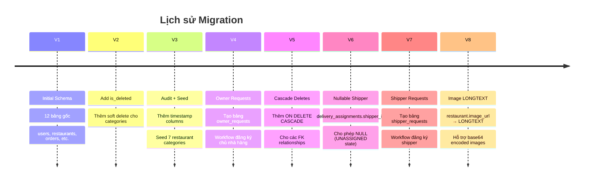

# 🏛️ PHẦN 1 — KIẾN TRÚC & CẤU HÌNH HỆ THỐNG

---

## 1.1. Kiến trúc tổng quan — Layered Architecture

Hệ thống backend tuân theo mô hình **Phân tầng (Layered Architecture)** với 4 tầng chính, mỗi tầng có trách nhiệm rõ ràng và chỉ giao tiếp với tầng liền kề.



> [!NOTE]
> Security Layer không phải một tầng tuần tự — nó hoạt động như một **cross-cutting concern** xuyên suốt filter chain, chặn mọi request trước khi đến Controller.

---

## 1.2. Entry Point — `ServerApplication.java`

[ServerApplication.java](file:///c:/Users/bachp/Downloads/Mini-Food-Delivery/SRC/backend/src/main/java/com/example/server/ServerApplication.java)

### 1.2.1. Dotenv Integration

Ứng dụng sử dụng thư viện `cdimascio.dotenv-java` để tải biến môi trường từ file `.env` trước khi Spring Boot khởi tạo context:

```java
// Thử tải từ working directory trước
Dotenv dotenv = Dotenv.configure().ignoreIfMissing().load();

// Nếu không tìm thấy, thử SRC/backend/
if (dotenv.entries().isEmpty()) {
    dotenv = Dotenv.configure().directory("SRC/backend").ignoreIfMissing().load();
}

// Chỉ set system property nếu chưa tồn tại (ưu tiên biến hệ thống)
dotenv.entries().forEach(entry -> {
    if (System.getProperty(entry.getKey()) == null) {
        System.setProperty(entry.getKey(), entry.getValue());
    }
});
```

> [!TIP]
> Cơ chế fallback 2 cấp cho phép chạy ứng dụng từ cả thư mục gốc dự án lẫn thư mục `SRC/backend/`. System properties có độ ưu tiên cao hơn `.env`.

### 1.2.2. Smoke Mode

Chế độ đặc biệt cho phép khởi động nhanh **không cần MySQL**:

```java
private static boolean isSmokeModeEnabled() {
    String env = System.getenv("APP_SMOKE_MODE");       // Biến môi trường
    String prop = System.getProperty("app.smokeMode");   // System property
    return "true".equalsIgnoreCase(env) || "true".equalsIgnoreCase(prop);
}
```

Khi bật, tự động exclude 3 auto-configurations:
- `DataSourceAutoConfiguration`
- `HibernateJpaAutoConfiguration`  
- `JpaRepositoriesAutoConfiguration`

### 1.2.3. Health Check (CommandLineRunner)

Sau khi context khởi tạo xong, ứng dụng tự động:

| Bước | Hành động | Chi tiết |
|:----:|:----------|:---------|
| 1 | Xác định port | Ưu tiên `local.server.port` → fallback `server.port` → `8080` |
| 2 | In API Base URL | `http://localhost:{port}/api` |
| 3 | In Swagger URL | `http://localhost:{port}/swagger-ui.html` |
| 4 | Test DB connection | `dataSource.getConnection()` → in tên DBMS |
| 5 | Đếm users | `userRepository.count()` → in số lượng |

Sử dụng `ObjectProvider<T>` thay vì inject trực tiếp để tránh lỗi khi ở Smoke Mode (khi beans không tồn tại).

---

## 1.3. Spring Profiles



### So sánh chi tiết các Profile

| Thuộc tính | `dev` | `prod` | `test` |
|:-----------|:------|:-------|:-------|
| **DB URL** | `localhost:3306/mini_food_db` + auto-create | `${DB_URL}` (env var) | Testcontainers dynamic |
| **ddl-auto** | `update` | `validate` | `validate` |
| **show-sql** | `true` | `false` | — |
| **Flyway clean** | `false` (disabled) | — | — |
| **JWT Secret** | Hardcoded fallback | `${JWT_SECRET}` | Test-specific |
| **DB Engine** | MySQL local | MySQL (any) | MySQL 8.0 (Docker) |

> [!WARNING]
> Profile `dev` chứa fallback JWT secret hardcoded. **Không bao giờ** sử dụng giá trị này trong production.

---

## 1.4. Configuration Classes

### 1.4.1. SecurityConfig

[SecurityConfig.java](file:///c:/Users/bachp/Downloads/Mini-Food-Delivery/SRC/backend/src/main/java/com/example/server/config/SecurityConfig.java)

Cấu hình trung tâm của Spring Security:

```java
@Configuration
@EnableWebSecurity
@EnableMethodSecurity    // Kích hoạt @PreAuthorize
@RequiredArgsConstructor
public class SecurityConfig {
    
    @Bean SecurityFilterChain filterChain(HttpSecurity http) {
        http.csrf(AbstractHttpConfigurer::disable)              // Stateless = no CSRF
            .cors(cors -> cors.configurationSource(...))        // Custom CORS
            .sessionManagement(STATELESS)                       // No server-side session
            .authorizeHttpRequests(auth -> auth
                .requestMatchers("/api/auth/**").permitAll()     // Public auth
                .requestMatchers("/api/public/**").permitAll()   // Public endpoints
                .requestMatchers("/api/dev/**").permitAll()      // Dev tools
                .requestMatchers("/ws/**").permitAll()           // WebSocket
                .requestMatchers("/swagger-ui/**").permitAll()   // API docs
                .requestMatchers("/api/admin/**").hasRole("ADMIN")
                .requestMatchers("/api/shipper/**").hasAnyRole("SHIPPER", "ADMIN")
                .requestMatchers("/api/owner/**").hasAnyRole("OWNER", "ADMIN")
                .anyRequest().authenticated()
            );
        
        http.addFilterBefore(jwtAuthFilter, UsernamePasswordAuthenticationFilter.class);
    }
}
```

**CORS Configuration:**

| Thuộc tính | Giá trị |
|:-----------|:--------|
| Allowed Origins | `http://localhost:5173`, `http://127.0.0.1:5173` |
| Allowed Methods | GET, POST, PUT, PATCH, DELETE, OPTIONS |
| Allowed Headers | Authorization, Content-Type, X-Auth-Token, X-Requested-With, Accept, Origin |
| Exposed Headers | X-Auth-Token, Authorization |
| Allow Credentials | `true` |
| Max Age | 3600s (1 giờ) |

### 1.4.2. WebSocketConfig

[WebSocketConfig.java](file:///c:/Users/bachp/Downloads/Mini-Food-Delivery/SRC/backend/src/main/java/com/example/server/config/WebSocketConfig.java)

Hệ thống sử dụng **STOMP over WebSocket** với SockJS fallback:



**Cấu hình chi tiết:**

- **Endpoint:** `/ws` với SockJS fallback (`withSockJS()`)
- **Broker prefix:** `/topic` — Clients subscribe tới các topic
- **App prefix:** `/app` — Clients gửi messages tới đây
- **CORS:** Cho phép tất cả origins (`setAllowedOriginPatterns("*")`)
- **Auth:** JWT validation trong `configureClientInboundChannel` interceptor

> [!IMPORTANT]
> WebSocket auth xảy ra tại thời điểm **STOMP CONNECT**, không phải mỗi message. Token được validate một lần và Principal được gán cho toàn bộ session.

### 1.4.3. OpenApiConfig

Cấu hình Swagger/OpenAPI documentation:
- **Title:** Mini Food Delivery API
- **Security Scheme:** JWT Bearer Token (`bearerAuth`)
- **Mọi endpoint** được apply security requirement mặc định

### 1.4.4. MapClientConfig

Cấu hình `RestClient` bean cho external API calls:
- **Purpose:** Gọi API bản đồ bên ngoài (geocoding, routing)
- **User-Agent:** Custom header để tránh bị block

### 1.4.5. WebConfig

Global CORS configuration cho MVC layer (bổ sung cho SecurityConfig CORS):
- Áp dụng cho tất cả path patterns

---

## 1.5. Flyway Database Migrations

Hệ thống sử dụng **8 migration files** để quản lý schema:



> [!NOTE]
> Migration V6 là bước quan trọng cho Event-Driven Architecture: cho phép tạo `DeliveryAssignment` với `shipper_id = NULL` khi đơn hàng ở trạng thái `READY` nhưng chưa có shipper nhận.
