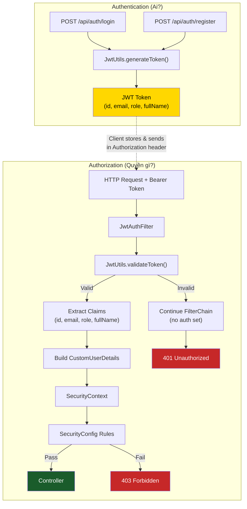
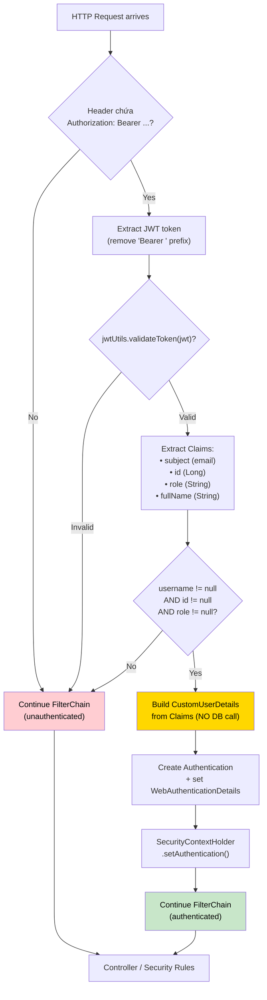
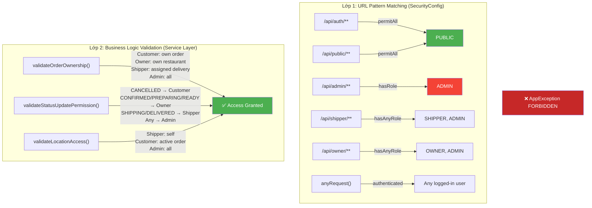
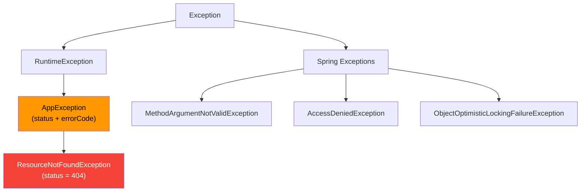

# 🔐 PHẦN 2 — BẢO MẬT & XÁC THỰC

---

## 2.1. Tổng quan cơ chế bảo mật

Hệ thống triển khai mô hình **Stateless JWT + RBAC** dựa trên Spring Security 6.4. Không sử dụng HTTP Session — mọi thông tin xác thực và phân quyền được mang theo trong JWT token.



---

## 2.2. JWT Token — Cấu trúc & Lifecycle

### 2.2.1. Token Generation

[JwtUtils.java](file:///c:/Users/bachp/Downloads/Mini-Food-Delivery/SRC/backend/src/main/java/com/example/server/security/JwtUtils.java) — Có **3 overload** của `generateToken()`:

| Variant | Sử dụng khi | Claims |
|:--------|:-----------|:-------|
| `generateToken(String username)` | Registration (chỉ có email) | `subject` |
| `generateToken(Long id, String username, String role, String fullName)` | Login thành công | `subject`, `id`, `role`, `fullName` |
| `generateToken(CustomUserDetails)` | Delegate → gọi variant 2 | Tự extract từ UserDetails |

### 2.2.2. Token Payload

```json
{
  "sub": "user@example.com",        // subject = email
  "id": 42,                         // user ID (Long)
  "role": "ROLE_CUSTOMER",          // prefixed with ROLE_
  "fullName": "Nguyễn Văn A",       // display name
  "iat": 1715400000,                // issued at
  "exp": 1715486400                 // expiration (iat + 24h)
}
```

### 2.2.3. Signing & Validation

```
Signing Algorithm:    HMAC-SHA (HS256+, key size ≥ 256 bits)
Secret Source:        ${app.jwt.secret}
Key Derivation:      Keys.hmacShaKeyFor(secret.getBytes(UTF_8))
Token Expiration:     ${app.jwt.expiration-ms} = 86,400,000ms (24 giờ)
```

**Validation error handling** — Mỗi loại lỗi được log riêng:

| Exception | Ý nghĩa | Severity |
|:----------|:---------|:---------|
| `MalformedJwtException` | Token bị chỉnh sửa / format sai | 🔴 Error |
| `ExpiredJwtException` | Token hết hạn | 🟡 Expected |
| `UnsupportedJwtException` | Algorithm không hỗ trợ | 🔴 Error |
| `IllegalArgumentException` | Claims string rỗng | 🔴 Error |

---

## 2.3. JwtAuthFilter — Request Interceptor

[JwtAuthFilter.java](file:///c:/Users/bachp/Downloads/Mini-Food-Delivery/SRC/backend/src/main/java/com/example/server/security/JwtAuthFilter.java)

Khác biệt quan trọng so với pattern phổ biến: **Filter này KHÔNG gọi database**. Toàn bộ thông tin user được reconstruct từ JWT claims:



> [!TIP]
> **Performance advantage:** Bằng việc embed user data vào JWT, filter tránh được database lookup trên mỗi request. Trade-off: role changes chỉ có effect sau khi user re-login (lấy token mới).

### Bảo vệ cấp lập trình

```java
// Wrap toàn bộ logic trong try-catch
// → Nếu bất kỳ exception nào xảy ra, request vẫn tiếp tục (unauthenticated)
// → Tránh crash toàn bộ filter chain
try {
    String jwt = parseJwt(request);
    if (jwt != null && jwtUtils.validateToken(jwt)) { ... }
} catch (Exception e) {
    log.error("Cannot set user authentication: {}", e.getMessage());
}
filterChain.doFilter(request, response);  // ALWAYS continues
```

---

## 2.4. CustomUserDetails — Bridge Entity ↔ Spring Security

[CustomUserDetails.java](file:///c:/Users/bachp/Downloads/Mini-Food-Delivery/SRC/backend/src/main/java/com/example/server/security/CustomUserDetails.java)

Triển khai `UserDetails` của Spring Security với Lombok `@Builder`:

| Field | Type | Vai trò |
|:------|:-----|:--------|
| `id` | `Long` | ID user trong DB — truyền qua `@AuthenticationPrincipal` |
| `email` | `String` | Dùng làm `username` (getUsername → email) |
| `password` | `String` | BCrypt hash — chỉ cần khi login |
| `fullName` | `String` | Metadata hiển thị |
| `authorities` | `Collection<GrantedAuthority>` | Luôn chứa **1 phần tử**: `ROLE_xxx` |

```java
// Tất cả trả về true — chưa implement account locking
isAccountNonExpired()     → true
isAccountNonLocked()      → true
isCredentialsNonExpired() → true
isEnabled()               → true
```

### CustomUserDetailsService

[CustomUserDetailsService.java](file:///c:/Users/bachp/Downloads/Mini-Food-Delivery/SRC/backend/src/main/java/com/example/server/security/CustomUserDetailsService.java)

Sử dụng **2 nơi**:
1. **Login flow:** `AuthenticationManager` gọi `loadUserByUsername()` để verify password
2. **WebSocket CONNECT:** Interceptor gọi để build `Authentication` cho STOMP session

```java
@Override
public UserDetails loadUserByUsername(String email) throws UsernameNotFoundException {
    User user = userRepository.findByEmail(email)
            .orElseThrow(() -> new UsernameNotFoundException("User not found: " + email));
    return CustomUserDetails.build(user);  // Gọi static factory method
}
```

---

## 2.5. Role-Based Access Control (RBAC)

### 2.5.1. Hệ thống phân quyền 2 lớp



### 2.5.2. Role enum — String Constants

```java
public enum Role {
    CUSTOMER, SHIPPER, OWNER, ADMIN;
    
    // Static constants dùng trong SecurityConfig (hasRole cần String)
    public static final String ROLE_ADMIN = "ADMIN";
    public static final String ROLE_SHIPPER = "SHIPPER";
    public static final String ROLE_OWNER = "OWNER";
    public static final String ROLE_CUSTOMER = "CUSTOMER";
}
```

> [!NOTE]
> Spring Security `hasRole("ADMIN")` tự động thêm prefix `ROLE_` khi kiểm tra authority. Trong DB và JWT, role được lưu dưới dạng `ROLE_ADMIN`, `ROLE_CUSTOMER`, etc.

---

## 2.6. Xử lý Ngoại lệ Tập trung (GlobalExceptionHandler)

[GlobalExceptionHandler.java](file:///c:/Users/bachp/Downloads/Mini-Food-Delivery/SRC/backend/src/main/java/com/example/server/exception/GlobalExceptionHandler.java)

### 2.6.1. Exception Hierarchy



### 2.6.2. Handler Matrix

| Handler | Exception | HTTP Status | Error Code | Response `data` |
|:--------|:----------|:-----------:|:-----------|:----------------|
| `handleValidationExceptions` | `MethodArgumentNotValidException` | `400` | `VALIDATION_ERROR` | `Map<field, message>` |
| `handleResourceNotFound` | `ResourceNotFoundException` | `404` | `RESOURCE_NOT_FOUND` | — |
| `handleAppException` | `AppException` | Dynamic | Dynamic | — |
| `handleAccessDenied` | `AccessDeniedException` | `403` | `FORBIDDEN` | — |
| `handleOptimisticLockingFailure` | `ObjectOptimisticLockingFailureException` | `409` | `CONCURRENCY_FAILURE` | — |
| `handleGlobalException` | `Exception` (catch-all) | `500` | `INTERNAL_SERVER_ERROR` | — |

### 2.6.3. Consistent Response Format

Mọi response (success hoặc error) đều tuân theo cấu trúc `ApiResponse<T>`:

```json
{
  "success": false,
  "message": "Validation failed",
  "data": {
    "email": "must be a valid email address",
    "password": "size must be between 6 and 255"
  },
  "timestamp": "2026-05-11T15:30:00",
  "errorCode": "VALIDATION_ERROR"
}
```

---

## 2.7. Danh mục Error Codes

| Code | HTTP | Trigger | Mô tả |
|:-----|:----:|:--------|:-------|
| `AUTH_FAILED` | 401 | Login thất bại | Email/password không đúng |
| `EMAIL_EXISTS` | 400 | Register | Email đã được sử dụng |
| `VALIDATION_ERROR` | 400 | Jakarta Validation | DTO không hợp lệ |
| `RESOURCE_NOT_FOUND` | 404 | Repository lookup | Entity không tồn tại |
| `FORBIDDEN` | 403 | AccessDenied | Không đủ quyền |
| `INVALID_ROLE` | 400 | Assign shipper | User không phải shipper |
| `INVALID_TRANSITION` | 400 | Order status update | Chuyển trạng thái không hợp lệ |
| `INVALID_STATE` | 400 | Delivery update | Assignment status không đúng |
| `INVALID_CATEGORY` | 400 | Menu operations | Category không thuộc restaurant |
| `COD_NOT_COLLECTED` | 400 | Mark delivered | Chưa thu tiền COD |
| `UNAUTHORIZED_UPDATE` | 403 | Delivery update | Shipper khác cố cập nhật |
| `UNAUTHORIZED_ACCESS` | 403 | Order/Location access | Không có quyền xem |
| `UNAUTHORIZED_RESTAURANT_ACCESS` | 403 | Restaurant ops | Không phải chủ nhà hàng |
| `UNAUTHORIZED_ADDRESS_ACCESS` | 403 | Address ops | Địa chỉ không thuộc user |
| `UNAUTHORIZED_NOTIFICATION_ACCESS` | 403 | Notification ops | Thông báo không thuộc user |
| `PENDING_REQUEST_EXISTS` | 400 | Owner/Shipper request | Đã có request đang chờ |
| `REQUEST_ALREADY_PROCESSED` | 400 | Process request | Request đã được xử lý |
| `CONCURRENCY_FAILURE` | 409 | Optimistic locking | Dữ liệu bị sửa đồng thời |
| `INTERNAL_SERVER_ERROR` | 500 | Catch-all | Lỗi không xác định |

---

## 2.8. Optimistic Locking

Hai entity sử dụng `@Version` để phòng chống **concurrent modification**:

| Entity | Field | Mục đích |
|:-------|:------|:---------|
| `Order` | `@Version Integer version` | Nhiều actor (Customer cancel, Owner update, Shipper deliver) có thể update cùng lúc |
| `DeliveryAssignment` | `@Version Integer version` | Nhiều shipper có thể cố gán mình vào cùng 1 đơn |

Khi xảy ra conflict → `ObjectOptimisticLockingFailureException` → `409 CONCURRENCY_FAILURE` → Client retry.
