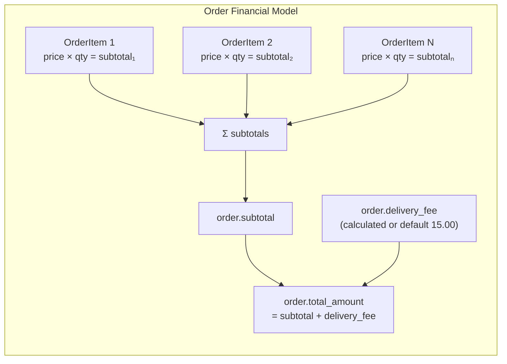
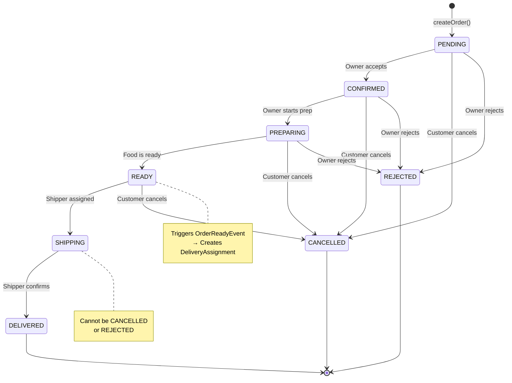
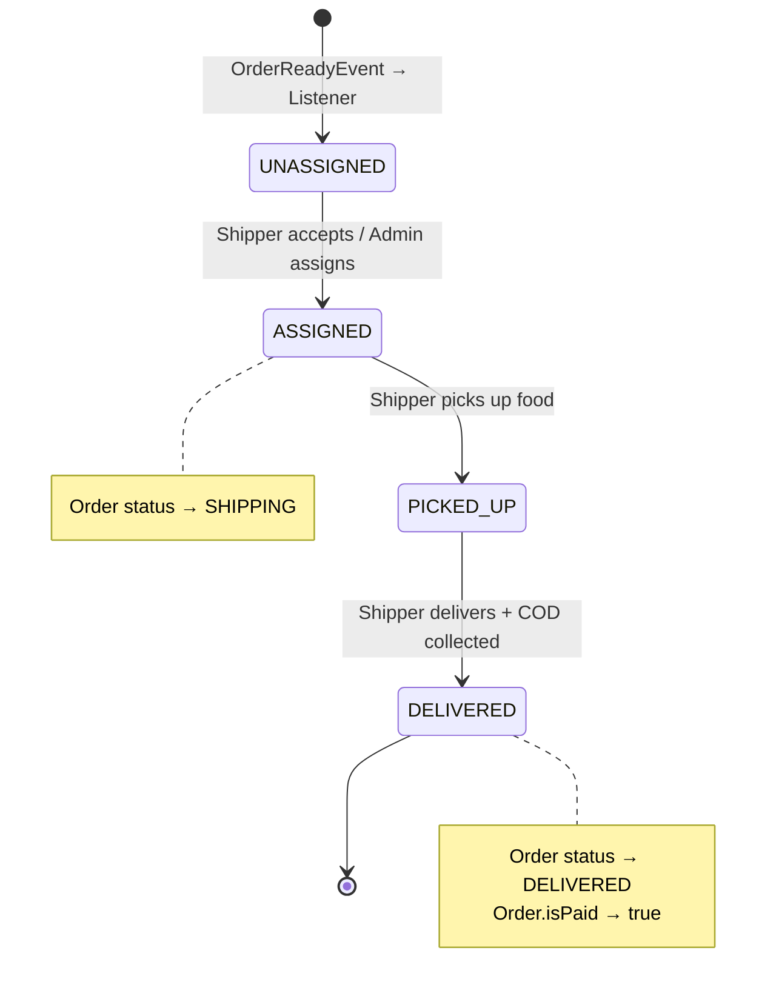

# 📊 PHẦN 3 — MÔ HÌNH DỮ LIỆU

---

## 3.1. Entity Relationship Diagram

```mermaid
erDiagram
    USER ||--o{ ADDRESS : "has addresses"
    USER ||--o{ RESTAURANT : "owns (as OWNER)"
    USER ||--o{ ORDER : "places (as CUSTOMER)"
    USER ||--o{ DELIVERY_ASSIGNMENT : "delivers (as SHIPPER)"
    USER ||--o{ ORDER_STATUS_HISTORY : "changed_by"
    USER ||--o{ NOTIFICATION : "receives"
    USER ||--o{ OWNER_REQUEST : "submits"
    USER ||--o{ SHIPPER_REQUEST : "submits"
    USER ||--o| SHIPPER_LOCATION : "tracked_at"

    RESTAURANT_CATEGORY ||--o{ RESTAURANT : "categorizes"
    RESTAURANT ||--o{ MENU_CATEGORY : "has categories"
    RESTAURANT ||--o{ MENU_ITEM : "offers items"
    RESTAURANT ||--o{ ORDER : "receives orders"

    MENU_CATEGORY ||--o{ MENU_ITEM : "groups"

    ORDER ||--o{ ORDER_ITEM : "contains"
    ORDER ||--o{ ORDER_STATUS_HISTORY : "has timeline"
    ORDER ||--o| DELIVERY_ASSIGNMENT : "assigned to"

    MENU_ITEM ||--o{ ORDER_ITEM : "snapshot of"

    USER {
        bigint id PK
        varchar email UK
        varchar password
        varchar full_name
        varchar phone UK
        varchar avatar_url
        varchar role
        boolean is_active
        boolean is_deleted
        timestamp created_at
        timestamp updated_at
    }

    RESTAURANT {
        bigint id PK
        bigint owner_id FK
        bigint category_id FK
        varchar name
        text description
        varchar phone
        varchar address
        decimal latitude
        decimal longitude
        longtext image_url
        time opening_time
        time closing_time
        boolean is_open
        boolean is_approved
        boolean is_deleted
        timestamp created_at
        timestamp updated_at
    }

    ORDER {
        bigint id PK
        bigint user_id FK
        bigint restaurant_id FK
        varchar delivery_address
        decimal delivery_lat
        decimal delivery_lng
        decimal subtotal
        decimal delivery_fee
        decimal total_amount
        varchar payment_method
        varchar status
        boolean is_paid
        varchar note
        integer version
        timestamp created_at
        timestamp updated_at
    }

    DELIVERY_ASSIGNMENT {
        bigint id PK
        bigint order_id FK_UK
        bigint shipper_id FK
        varchar status
        timestamp picked_up_at
        timestamp delivered_at
        integer version
        timestamp created_at
    }

    MENU_ITEM {
        bigint id PK
        bigint restaurant_id FK
        bigint category_id FK
        varchar name
        text description
        decimal price
        longtext image_url
        boolean is_available
        boolean is_deleted
        timestamp created_at
        timestamp updated_at
    }

    ORDER_ITEM {
        bigint id PK
        bigint order_id FK
        bigint menu_item_id FK
        varchar item_name
        decimal item_price
        integer quantity
        decimal subtotal
        varchar note
    }

    OWNER_REQUEST {
        bigint id PK
        bigint user_id FK
        varchar restaurant_name
        varchar restaurant_address
        varchar restaurant_phone
        text description
        enum status
        text admin_note
        timestamp created_at
        timestamp updated_at
    }

    SHIPPER_REQUEST {
        bigint id PK
        bigint user_id FK
        varchar vehicle_type
        varchar vehicle_number
        text note
        enum status
        text admin_note
        timestamp created_at
        timestamp updated_at
    }
```

---

## 3.2. Chi tiết 14 JPA Entities

### 3.2.1. `User` — Trung tâm hệ thống

[User.java](file:///c:/Users/bachp/Downloads/Mini-Food-Delivery/SRC/backend/src/main/java/com/example/server/entity/User.java)

> Root entity kết nối tất cả domain objects. Một `User` có thể đóng nhiều vai trò tùy theo `role`.

| Column | Type | Constraints | Ghi chú |
|:-------|:-----|:-----------|:--------|
| `id` | BIGINT | PK, AUTO_INCREMENT | — |
| `email` | VARCHAR(255) | UNIQUE, NOT NULL | Username cho auth |
| `password` | VARCHAR(255) | NOT NULL | BCrypt encoded |
| `full_name` | VARCHAR(100) | NOT NULL | — |
| `phone` | VARCHAR(15) | UNIQUE | Nullable |
| `avatar_url` | VARCHAR(500) | — | — |
| `role` | VARCHAR(50) | NOT NULL, DEFAULT 'USER' | `ROLE_CUSTOMER` / `ROLE_OWNER` / `ROLE_SHIPPER` / `ROLE_ADMIN` |
| `is_active` | BOOLEAN | DEFAULT TRUE | Admin có thể vô hiệu hóa |
| `is_deleted` | BOOLEAN | DEFAULT FALSE | Soft delete |
| `created_at` | TIMESTAMP | NOT NULL | `@PrePersist` |
| `updated_at` | TIMESTAMP | NOT NULL | `@PreUpdate` |

**Relationships từ User:**

```
User ──┬── 1:N → Address          (addresses)
       ├── 1:N → Restaurant        (restaurants, as owner)
       ├── 1:N → Order             (orders, as customer)
       ├── 1:N → DeliveryAssignment (deliveryAssignment, as shipper)
       ├── 1:N → OrderStatusHistory (orderStatusHistories, as changedBy)
       ├── 1:N → Notification      (notifications)
       ├── 1:N → OwnerRequest      (ownerRequests)
       └── 1:1 → ShipperLocation   (shipperLocation)
```

> Tất cả relationships sử dụng `CascadeType.ALL` + `orphanRemoval = true`.

### 3.2.2. `Restaurant` — Đơn vị kinh doanh

[Restaurant.java](file:///c:/Users/bachp/Downloads/Mini-Food-Delivery/SRC/backend/src/main/java/com/example/server/entity/Restaurant.java)

**Đặc điểm thiết kế:**
- **Triple boolean flags**: `isOpen` (trạng thái hoạt động), `isApproved` (admin đã duyệt), `isDeleted` (soft delete)
- **Geolocation**: `latitude`/`longitude` với precision `DECIMAL(10,8)` / `DECIMAL(11,8)` — đủ chính xác tới ~1mm
- **Operating hours**: `openingTime` / `closingTime` kiểu `LocalTime`
- **Image**: `image_url` kiểu `LONGTEXT` (sau migration V8) — hỗ trợ base64 encoded images

### 3.2.3. `Order` — Entity giao dịch cốt lõi

[Order.java](file:///c:/Users/bachp/Downloads/Mini-Food-Delivery/SRC/backend/src/main/java/com/example/server/entity/Order.java)



**Key design decisions:**
- **`@Version Integer version`** — Optimistic locking cho concurrent status updates
- **`is_paid`** — Chỉ set `true` khi shipper xác nhận giao hàng thành công (COD collected)
- **Delivery coordinates**: Lưu riêng `delivery_lat`/`delivery_lng` bên cạnh `delivery_address` (text) → Hỗ trợ geospatial queries

### 3.2.4. `DeliveryAssignment` — Cầu nối Order ↔ Shipper

[DeliveryAssignment.java](file:///c:/Users/bachp/Downloads/Mini-Food-Delivery/SRC/backend/src/main/java/com/example/server/entity/DeliveryAssignment.java)

| Column | Type | Key point |
|:-------|:-----|:----------|
| `order_id` | BIGINT | FK + UNIQUE → 1 order = 1 assignment |
| `shipper_id` | BIGINT | FK, **NULLABLE** (trạng thái UNASSIGNED) |
| `status` | VARCHAR(50) | State machine: UNASSIGNED → ASSIGNED → PICKED_UP → DELIVERED |
| `picked_up_at` | TIMESTAMP | Set khi shipper lấy hàng |
| `delivered_at` | TIMESTAMP | Set khi giao hàng xong |
| `version` | INTEGER | Optimistic locking |

> [!IMPORTANT]
> `shipper_id` nullable (migration V6) là yếu tố then chốt cho event-driven workflow: khi order READY → tự động tạo assignment UNASSIGNED (chưa có shipper).

### 3.2.5. `OrderItem` — Snapshot Pattern

```
┌─────────────────────────────────────────────────┐
│ OrderItem #1                                    │
│ ┌─────────────────┐  ┌────────────────────────┐ │
│ │ menu_item_id: 5 │  │ item_name: "Phở bò"   │ │
│ │ (FK reference)  │  │ item_price: 45000.00   │ │
│ │                 │  │ (SNAPSHOT at order time)│ │
│ └─────────────────┘  └────────────────────────┘ │
│ quantity: 2                                     │
│ subtotal: 90000.00                              │
└─────────────────────────────────────────────────┘
```

> **Tại sao lưu snapshot?** Nếu nhà hàng thay đổi giá hoặc tên món sau khi đơn được đặt, dữ liệu lịch sử vẫn chính xác. `menu_item_id` chỉ dùng để tham chiếu ngược, không phải nguồn sự thật cho giá/tên.

---

## 3.3. State Machines

### 3.3.1. Order Status State Machine



**Validation logic** (`validateStateTransition()`):

```java
boolean valid = switch (current) {
    case PENDING   -> next == CONFIRMED;
    case CONFIRMED -> next == PREPARING;
    case PREPARING -> next == READY;
    case READY     -> next == SHIPPING;
    case SHIPPING  -> next == DELIVERED;
    default        -> false;
};

// Special: CANCELLED/REJECTED allowed from any state BEFORE SHIPPING
if (next == CANCELLED || next == REJECTED) {
    if (current == SHIPPING || current == DELIVERED) {
        throw INVALID_TRANSITION;
    }
    return; // allowed
}
```

### 3.3.2. Delivery Assignment Status



---

## 3.4. Flyway Migration History

| Version | File | Thay đổi |
|:--------|:-----|:---------|
| **V1** | `V1__init_schema.sql` | Schema ban đầu: 12 bảng (users, addresses, restaurant_categories, restaurants, categories, menu_items, orders, order_items, order_status_history, delivery_assignments, shipper_locations, notifications) |
| **V2** | `V2__add_is_deleted_to_categories.sql` | Thêm `is_deleted BOOLEAN DEFAULT FALSE` vào bảng `categories` |
| **V3** | `V3__audit_columns_and_seed_categories.sql` | Thêm `created_at`/`updated_at` cho `restaurant_categories`; Seed 7 categories: Rice, Fast Food, Sea Food, Dry Dish, Soup Dish, Drink, Dessert |
| **V4** | `V4__create_owner_requests_table.sql` | Tạo bảng `owner_requests` cho workflow đăng ký chủ nhà hàng |
| **V5** | `V5__add_cascade_deletes.sql` | Bổ sung `ON DELETE CASCADE` cho các foreign key relationships |
| **V6** | `V6__nullable_shipper_in_delivery.sql` | `delivery_assignments.shipper_id` → NULLABLE (cho phép UNASSIGNED state) |
| **V7** | `V7__create_shipper_requests_table.sql` | Tạo bảng `shipper_requests` cho workflow đăng ký shipper |
| **V8** | `V8__restaurant_image_url_longtext.sql` | `restaurants.image_url` VARCHAR → LONGTEXT (hỗ trợ base64) |

---

## 3.5. JPA Lifecycle Hooks

Mọi entity có timestamps đều sử dụng callback thủ công thay vì Spring `@EnableJpaAuditing`:

```java
@PrePersist
protected void onCreate() {
    createdAt = LocalDateTime.now();
    updatedAt = LocalDateTime.now();  // ← Tránh updatedAt = null khi insert
}

@PreUpdate
protected void onUpdate() {
    updatedAt = LocalDateTime.now();
}
```

**Entities sử dụng lifecycle hooks:** User, Restaurant, MenuItem, Order, DeliveryAssignment, OrderStatusHistory, OwnerRequest, ShipperRequest, ShipperLocation

---

## 3.6. Đặc điểm thiết kế nổi bật

| Pattern | Áp dụng tại | Mục đích |
|:--------|:-----------|:---------|
| **Soft Delete** | User, Restaurant, MenuCategory, MenuItem | Giữ lại dữ liệu lịch sử, không xóa vật lý |
| **Snapshot** | OrderItem (item_name, item_price) | Bất biến hóa dữ liệu đơn hàng |
| **Optimistic Locking** | Order, DeliveryAssignment (`@Version`) | Phòng chống concurrent modification |
| **Geolocation** | Restaurant, Order, ShipperLocation | DECIMAL(10,8) / DECIMAL(11,8) — precision ~1mm |
| **Event-Driven** | Order → DeliveryAssignment | Tách rời nghiệp vụ qua `ApplicationEvent` |
| **Triple Boolean** | Restaurant (isOpen, isApproved, isDeleted) | 3 chiều trạng thái độc lập |
| **Cascade ALL** | User → * relationships | Parent xóa → children tự động xóa |
| **Fetch LAZY** | Tất cả `@ManyToOne`, `@OneToOne` | Tối ưu query, chỉ load khi truy cập |
