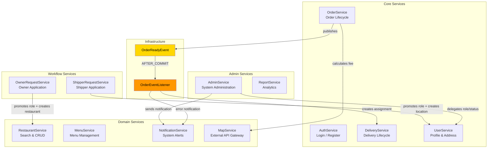
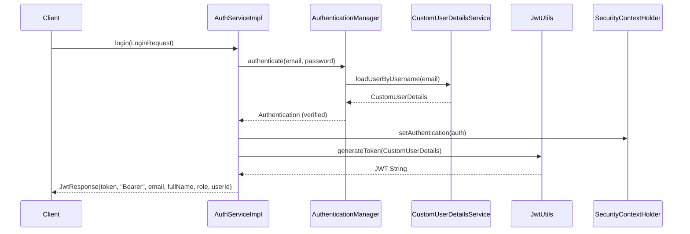
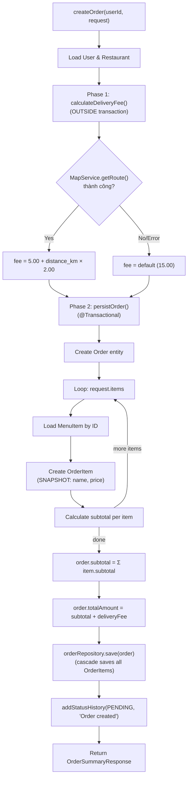
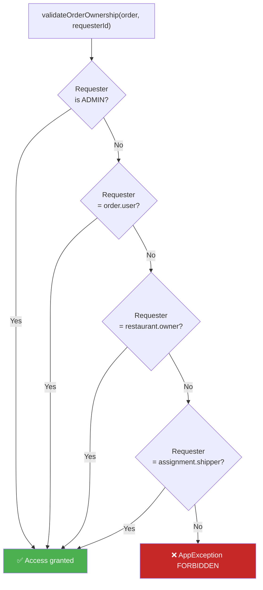
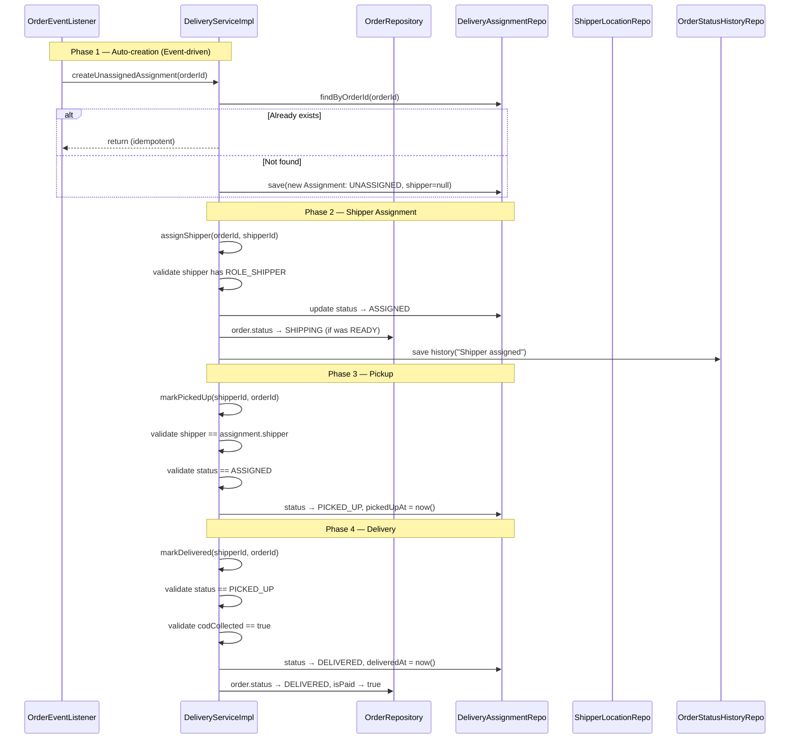
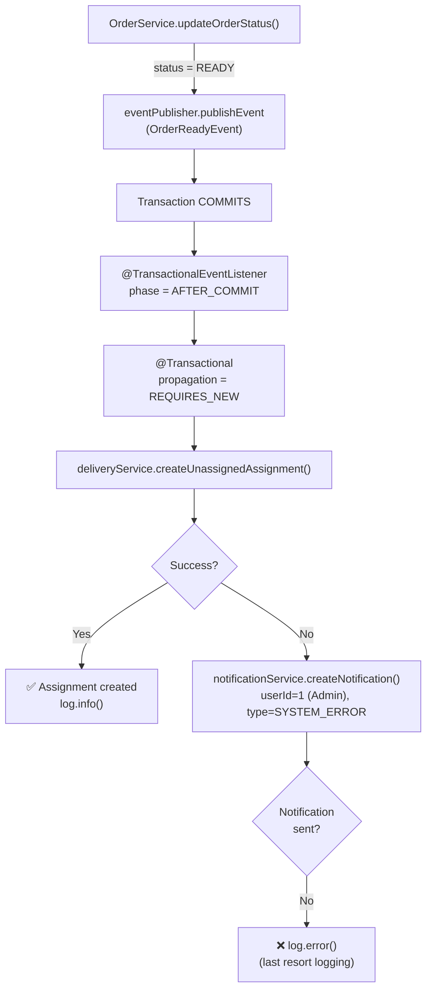
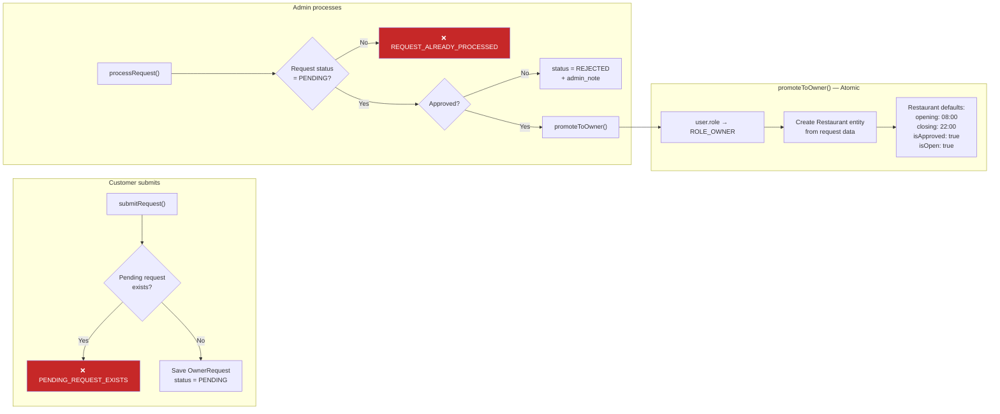

# ⚙️ PHẦN 4 — TẦNG LOGIC NGHIỆP VỤ (SERVICE LAYER)

---

## 4.1. Tổng quan tổ chức

Tầng nghiệp vụ tuân theo pattern **Interface + Implementation**, với 12 service interfaces và 12 implementations tương ứng:

```
service/
├── AdminService.java         → impl/AdminServiceImpl.java
├── AuthService.java          → impl/AuthServiceImpl.java
├── DeliveryService.java      → impl/DeliveryServiceImpl.java
├── MapService.java           → impl/MapServiceImpl.java
├── MenuService.java          → impl/MenuServiceImpl.java
├── NotificationService.java  → impl/NotificationServiceImpl.java
├── OrderService.java         → impl/OrderServiceImpl.java
├── OwnerRequestService.java  → impl/OwnerRequestServiceImpl.java
├── ReportService.java        → impl/ReportServiceImpl.java
├── RestaurantService.java    → impl/RestaurantServiceImpl.java
├── ShipperRequestService.java→ impl/ShipperRequestServiceImpl.java
└── UserService.java          → impl/UserServiceImpl.java
```

**Quy ước chung:**
- Mọi implementation: `@Service` + `@RequiredArgsConstructor`
- Phương thức ghi dữ liệu: `@Transactional`
- Dependencies: Constructor injection qua Lombok
- Logging: `@Slf4j`

---

## 4.2. Service Dependency Graph



---

## 4.3. AuthService — Xác thực & Đăng ký

[AuthServiceImpl.java](file:///c:/Users/bachp/Downloads/Mini-Food-Delivery/SRC/backend/src/main/java/com/example/server/service/impl/AuthServiceImpl.java)

### Login Flow



### Register Flow

```
1. existsByEmail(email) → true? throw EMAIL_EXISTS (400)
2. BCryptPasswordEncoder.encode(password)
3. new User(email, encodedPw, fullName, phone, "ROLE_CUSTOMER", active=true)
4. userRepository.save(user)
5. generateToken(user.email) → JwtResponse
```

> [!NOTE]
> Registration chỉ tạo `CUSTOMER`. Để trở thành `OWNER` hoặc `SHIPPER`, user phải submit request qua OwnerRequestService / ShipperRequestService.

---

## 4.4. OrderService — Vòng đời đơn hàng

[OrderServiceImpl.java](file:///c:/Users/bachp/Downloads/Mini-Food-Delivery/SRC/backend/src/main/java/com/example/server/service/impl/OrderServiceImpl.java) — **295 dòng**, service phức tạp nhất.

### 4.4.1. Create Order — 2-Phase Design



> [!IMPORTANT]
> **Tại sao tách 2 phase?** `calculateDeliveryFee()` gọi external API (MapService) có thể chậm/fail. Nếu đặt trong `@Transactional`, connection pool sẽ bị hold lâu. Tách ra ngoài → external call fail không ảnh hưởng transaction.

### 4.4.2. Delivery Fee Calculation

```java
// Base formula: 5.00 VND + 2.00 VND per km
BigDecimal deliveryFee = BigDecimal.valueOf(5.00 + (distanceKm * 2.00))
        .setScale(2, RoundingMode.HALF_UP);
```

Fallback: `${app.delivery.default-fee:15.00}` khi API call thất bại.

### 4.4.3. Update Order Status — Permission Matrix

```
┌────────────────────────┬───────────────────────────────────────┐
│ Target Status          │ Ai có quyền?                         │
├────────────────────────┼───────────────────────────────────────┤
│ CONFIRMED              │ Restaurant Owner (of this order)      │
│ PREPARING              │ Restaurant Owner                     │
│ READY                  │ Restaurant Owner                     │
│ REJECTED               │ Restaurant Owner                     │
│ SHIPPING               │ Assigned Shipper                     │
│ DELIVERED              │ Assigned Shipper                     │
│ CANCELLED              │ Customer (who placed order)          │
│ * (any)                │ ADMIN (always allowed)               │
└────────────────────────┴───────────────────────────────────────┘
```

### 4.4.4. Order Ownership Validation



---

## 4.5. DeliveryService — Vòng đời giao hàng

[DeliveryServiceImpl.java](file:///c:/Users/bachp/Downloads/Mini-Food-Delivery/SRC/backend/src/main/java/com/example/server/service/impl/DeliveryServiceImpl.java) — **246 dòng**

### 4.5.1. Delivery Lifecycle



### 4.5.2. COD Enforcement

```java
if (Boolean.FALSE.equals(request.getCodCollected())) {
    throw new AppException(HttpStatus.BAD_REQUEST, 
        "COD must be collected to mark as delivered", "COD_NOT_COLLECTED");
}
```

> Shipper **phải** xác nhận thu tiền COD trước khi đánh dấu giao hàng thành công. Đây là business rule bắt buộc.

### 4.5.3. Location Access Control

```
Ai có thể xem vị trí shipper?
├── ADMIN → luôn được
├── Shipper → xem vị trí chính mình
├── Customer → chỉ khi có đơn đang được giao bởi shipper đó
│              (assignment status = ASSIGNED hoặc PICKED_UP)
└── Khác → ❌ FORBIDDEN
```

---

## 4.6. Event-Driven Architecture

### 4.6.1. OrderReadyEvent

[OrderReadyEvent.java](file:///c:/Users/bachp/Downloads/Mini-Food-Delivery/SRC/backend/src/main/java/com/example/server/event/OrderReadyEvent.java)

```java
public class OrderReadyEvent extends ApplicationEvent {
    private final Long orderId;
    
    public OrderReadyEvent(Object source, Long orderId) {
        super(source);
        this.orderId = orderId;
    }
}
```

### 4.6.2. OrderEventListener

[OrderEventListener.java](file:///c:/Users/bachp/Downloads/Mini-Food-Delivery/SRC/backend/src/main/java/com/example/server/listener/OrderEventListener.java)



**Key design choices:**

| Annotation | Tại sao? |
|:-----------|:---------|
| `@TransactionalEventListener(AFTER_COMMIT)` | Chỉ tạo assignment sau khi order status READY đã persist thành công |
| `@Transactional(REQUIRES_NEW)` | Transaction riêng biệt — nếu tạo assignment fail, không rollback order update |
| Error notification to userId=1 | Convention: Admin user ID #1 nhận system error alerts |

---

## 4.7. OwnerRequestService — Workflow nâng cấp Role

[OwnerRequestServiceImpl.java](file:///c:/Users/bachp/Downloads/Mini-Food-Delivery/SRC/backend/src/main/java/com/example/server/service/impl/OwnerRequestServiceImpl.java)



> [!TIP]
> `promoteToOwner()` là **atomic** (`@Transactional`): nếu tạo restaurant fail → role change cũng rollback. Restaurant được tạo tự động từ thông tin trong request, với giờ hoạt động mặc định 8:00–22:00.

---

## 4.8. RestaurantService — Tìm kiếm & Quản lý

### Search Logic

```java
// Repository: dynamic query với optional filters
@Query("SELECT r FROM Restaurant r WHERE " +
       "(:categoryId IS NULL OR r.category.id = :categoryId) AND " +
       "(:keywords IS NULL OR LOWER(r.name) LIKE LOWER(CONCAT('%', :keywords, '%'))) AND " +
       "r.isApproved = true AND r.isDeleted = false")
Page<Restaurant> searchRestaurants(keywords, categoryId, pageable);
```

**Filters:**
- `keywords` — case-insensitive LIKE trên `name`
- `categoryId` — exact match (nullable = bỏ qua filter)
- **Hard filters:** Chỉ trả về `isApproved=true AND isDeleted=false`
- **Sorting:** Custom `sortBy` + `sortDir` → `Sort.by(Direction, property)`
- **Pagination:** `PageRequest.of(page, size, sort)`

### Ownership Validation

Mọi thao tác write (update, delete) đều kiểm tra:

```java
if (!restaurant.getOwner().getId().equals(ownerId)) {
    throw new AppException(FORBIDDEN, "...", "UNAUTHORIZED_RESTAURANT_ACCESS");
}
```

---

## 4.9. MenuService — CRUD thực đơn

### Validation Chain

```
addMenuItem(ownerId, restaurantId, categoryId, request)
│
├── 1. Load restaurant by restaurantId
├── 2. validateRestaurantOwnership(restaurant, ownerId)
├── 3. Load category by categoryId
├── 4. Verify category.restaurant.id == restaurantId
│      (prevent cross-restaurant item injection)
├── 5. Create MenuItem entity
└── 6. Save and return MenuItemResponse
```

### Soft Delete

```java
deleteMenuItem(ownerId, itemId) {
    item.setIsDeleted(true);  // NOT physical delete
    menuItemRepository.save(item);
}

getMenuItem(id) {
    if (item.getIsDeleted()) throw ResourceNotFoundException;
}
```

---

## 4.10. NotificationService — Thông báo nội bộ

**Sử dụng bởi:**
- `AdminService.approveRestaurant()` → Thông báo owner về kết quả phê duyệt (type: `SYSTEM`)
- `OrderEventListener` → Thông báo admin khi tạo delivery assignment thất bại (type: `SYSTEM_ERROR`)

**Bulk operations:**
```java
// Mark all by type
@Modifying @Query("UPDATE Notification n SET n.isRead = true 
                    WHERE n.user.id = :userId AND n.type = :type")
void markAllByTypeAsRead(userId, type);

// Mark all (global)
@Modifying @Query("UPDATE Notification n SET n.isRead = true 
                    WHERE n.user.id = :userId")
void markAllAsRead(userId);
```

---

## 4.11. ReportService — Analytics

```java
getAdminReport(startDate, endDate) {
    return AdminReportSummaryResponse.builder()
        .startDate(startDate)
        .endDate(endDate)
        .totalRevenue(orderRepo.sumTotalRevenue(start, end) ?? BigDecimal.ZERO)
        .deliveredOrderCount(orderRepo.countDeliveredOrders(start, end))
        .activeUserCount(userRepo.findByRoleAndActiveTrue(...).size())
        .approvedRestaurantCount(restaurantRepo.countByIsApprovedTrue())
        .build();
}
```

Null-safe handling: `sumTotalRevenue()` có thể trả về `null` nếu không có đơn nào → fallback `BigDecimal.ZERO`.

---

## 4.12. MapService — External API Gateway

```java
@Service
public class MapServiceImpl implements MapService {
    private final RestClient restClient;  // Injected from MapClientConfig

    public List<SearchResult> searchAddress(String query) {
        // GET external geocoding API
    }

    public RoutingResponse getRoute(lat1, lng1, lat2, lng2) {
        // GET external routing API
        // Returns: distance (meters), duration (seconds), geometry
    }
}
```

> [!NOTE]
> `MapService` là **gateway pattern** — tách biệt hoàn toàn logic external API khỏi business logic. Nếu cần đổi provider (Google Maps → Mapbox), chỉ cần thay implementation.
