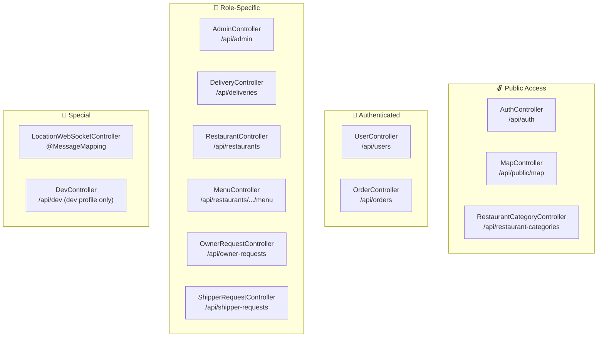
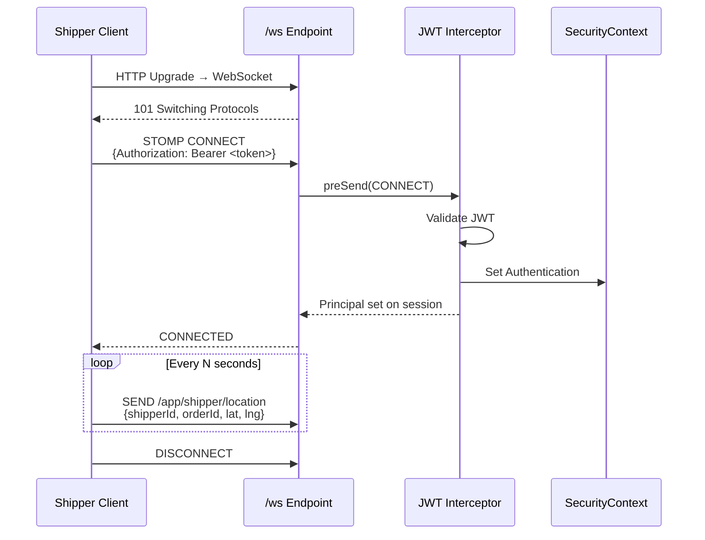

# 🌐 PHẦN 5 — REST API & WEBSOCKET

---

## 5.1. API Conventions

| Thuộc tính | Quy ước |
|:-----------|:--------|
| **Base URL** | `http://localhost:8080/api` |
| **Content-Type** | `application/json` |
| **Authentication** | `Authorization: Bearer <jwt_token>` |
| **Success Response** | `ApiResponse<T>` { success: true, message, data, timestamp } |
| **Error Response** | `ApiResponse<Object>` { success: false, message, errorCode, timestamp } |
| **Pagination** | `PageResponse<T>` { items, page, size, totalElements, totalPages, last } |

### Response Wrappers

```json
// ApiResponse<T> — Success
{
  "success": true,
  "message": "Order created successfully",
  "data": { /* domain object */ },
  "timestamp": "2026-05-11T15:30:00",
  "errorCode": null
}

// PageResponse<T> — Paginated
{
  "items": [ ... ],
  "page": 0,
  "size": 10,
  "totalElements": 42,
  "totalPages": 5,
  "last": false
}
```

---

## 5.2. Controller Map — 13 Controllers, 60+ Endpoints



---

## 5.3. Detailed Endpoint Reference

### 📌 AuthController — `/api/auth`

| Method | Path | Request Body | Response | Auth |
|:------:|:-----|:------------|:---------|:----:|
| `POST` | `/login` | `LoginRequest` { email, password } | `JwtResponse` | 🌐 Public |
| `POST` | `/register` | `RegisterRequest` { email✱, password✱, fullName✱, phone, avatarUrl } | `JwtResponse` | 🌐 Public |

> ✱ = Jakarta Validation: `@NotBlank`, `@Email`, `@Size(min=6)`, `@Pattern(10-15 digits)`

---

### 📌 AdminController — `/api/admin`

| Method | Path | Request | Response | Notes |
|:------:|:-----|:--------|:---------|:------|
| `GET` | `/stats` | — | `AdminStatsResponse` | Total users, restaurants, orders, revenue |
| `GET` | `/users` | — | `List<UserProfileResponse>` | All system users |
| `GET` | `/restaurants/pending` | — | `List<RestaurantCardResponse>` | Unapproved restaurants |
| `POST` | `/restaurants/{id}/approve` | `RestaurantApprovalRequest` { approved, note } | — | Sends notification to owner |
| `PATCH` | `/users/{id}/role` | `UserRoleUpdateRequest` { role } | — | ⚠️ Prevents self-demotion |
| `PATCH` | `/users/{id}/status` | `UserStatusUpdateRequest` { active } | — | ⚠️ Prevents self-deactivation |
| `DELETE` | `/users/{id}` | — | — | ⚠️ Prevents self-deletion |
| `GET` | `/reports/summary` | `?startDate&endDate` | `AdminReportSummaryResponse` | Date-range analytics |
| `GET` | `/reports/restaurants` | `?startDate&endDate` | `List<RestaurantRevenueResponse>` | Revenue by restaurant |
| `GET` | `/reports/export/csv` | `?startDate&endDate` | `byte[]` (CSV file) | Content-Disposition: attachment |

> Auth: All endpoints require **ROLE_ADMIN**

---

### 📌 OrderController — `/api/orders`

| Method | Path | Request | Response | Auth |
|:------:|:-----|:--------|:---------|:----:|
| `POST` | `/` | `CreateOrderRequest` | `OrderSummaryResponse` | CUSTOMER |
| `GET` | `/{id}` | — | `OrderSummaryResponse` | Authenticated¹ |
| `GET` | `/history` | `?page&size` | `PageResponse<OrderSummaryResponse>` | Authenticated |
| `PATCH` | `/{id}/status` | `OrderStatusUpdateRequest` { status, note } | — | Owner/Shipper/Admin² |
| `GET` | `/{id}/tracking` | — | `OrderTrackingResponse` | Authenticated¹ |
| `GET` | `/restaurant/{restaurantId}` | `?status` | `List<OrderSummaryResponse>` | OWNER |

> ¹ = Business-level ownership validation (see §4.4.4)  
> ² = Permission varies by target status (see §4.4.3)

**CreateOrderRequest structure:**

```json
{
  "restaurantId": 1,
  "deliveryAddress": "123 Nguyễn Huệ, Q.1, HCM",
  "deliveryLat": 10.77609,
  "deliveryLng": 106.70099,
  "paymentMethod": "COD",
  "note": "Giao trước 12h",
  "items": [
    { "menuItemId": 5, "quantity": 2, "note": "Không hành" },
    { "menuItemId": 8, "quantity": 1, "note": null }
  ]
}
```

---

### 📌 DeliveryController — `/api/deliveries`

| Method | Path | Request | Response | Auth |
|:------:|:-----|:--------|:---------|:----:|
| `POST` | `/assign` | `AssignShipperRequest` { orderId, shipperId } | `DeliveryAssignmentResponse` | ADMIN / SHIPPER |
| `PATCH` | `/{orderId}/pickup` | `MarkPickupRequest` | — | SHIPPER (assigned) |
| `PATCH` | `/{orderId}/deliver` | `MarkDeliveredRequest` { codCollected✱ } | — | SHIPPER (assigned) |
| `PUT` | `/location` | `ShipperLocationUpdateRequest` { lat, lng, isOnline } | — | SHIPPER |
| `GET` | `/{shipperId}/location` | — | `ShipperLocationResponse` | Authenticated³ |
| `GET` | `/available` | — | `List<DeliveryAssignmentResponse>` | SHIPPER |
| `GET` | `/my` | — | `List<DeliveryAssignmentResponse>` | SHIPPER |
| `GET` | `/order/{orderId}` | — | `DeliveryAssignmentResponse` | Authenticated³ |

> ³ = Business-level access validation (admin, self, associated customer)  
> ✱ = `codCollected` must be `true` to mark as delivered

---

### 📌 RestaurantController — `/api/restaurants`

| Method | Path | Request | Response | Auth |
|:------:|:-----|:--------|:---------|:----:|
| `POST` | `/search` | `RestaurantSearchRequest` { keyword, categoryId, page, size, sortBy, sortDir } | `PageResponse<RestaurantCardResponse>` | 🌐 Public |
| `GET` | `/{id}` | — | `RestaurantDetailResponse` (includes menu) | 🌐 Public |
| `GET` | `/my-restaurants` | — | `List<RestaurantCardResponse>` | OWNER |
| `POST` | `/` | `RestaurantRequest` | `RestaurantDetailResponse` | OWNER |
| `PUT` | `/{id}` | `RestaurantRequest` | `RestaurantDetailResponse` | OWNER (own) |
| `DELETE` | `/{id}` | — | — | OWNER (own, soft delete) |

---

### 📌 MenuController — `/api/restaurants/{restaurantId}/menu`

| Method | Path | Request | Response | Auth |
|:------:|:-----|:--------|:---------|:----:|
| `GET` | `/categories` | — | `List<MenuCategoryResponse>` | 🌐 Public |
| `POST` | `/categories` | `MenuCategoryRequest` { name } | `MenuCategoryResponse` | OWNER |
| `PUT` | `/categories/{categoryId}` | `MenuCategoryRequest` | `MenuCategoryResponse` | OWNER |
| `DELETE` | `/categories/{categoryId}` | — | — | OWNER (soft delete) |
| `POST` | `/categories/{categoryId}/items` | `MenuItemRequest` | `MenuItemResponse` | OWNER |
| `PUT` | `/items/{itemId}` | `MenuItemRequest` | `MenuItemResponse` | OWNER |
| `DELETE` | `/items/{itemId}` | — | — | OWNER (soft delete) |
| `GET` | `/items/{itemId}` | — | `MenuItemResponse` | 🌐 Public |

---

### 📌 UserController — `/api/users`

| Method | Path | Request | Response | Auth |
|:------:|:-----|:--------|:---------|:----:|
| `GET` | `/me` | — | `UserProfileResponse` | 🔐 |
| `PUT` | `/me` | `UserProfileUpdateRequest` { fullName, phone, avatarUrl } | `UserProfileResponse` | 🔐 |
| `DELETE` | `/me` | — | — | 🔐 |
| `GET` | `/me/addresses` | — | `List<AddressResponse>` | 🔐 |
| `POST` | `/me/addresses` | `AddressRequest` { label, addressLine, lat, lng, isDefault } | `AddressResponse` | 🔐 |
| `PUT` | `/me/addresses/{id}` | `AddressRequest` | `AddressResponse` | 🔐 |
| `DELETE` | `/me/addresses/{id}` | — | — | 🔐 |
| `PATCH` | `/me/addresses/{id}/default` | — | `AddressResponse` | 🔐 |
| `GET` | `/me/notifications` | — | `List<NotificationResponse>` | 🔐 |
| `PATCH` | `/me/notifications/read` | `MarkNotificationReadRequest` { notificationId } | — | 🔐 |
| `PATCH` | `/me/notifications/read-all` | `MarkAllNotificationsReadRequest` { type? } | — | 🔐 |

---

### 📌 OwnerRequestController — `/api/owner-requests`

| Method | Path | Request | Response | Auth |
|:------:|:-----|:--------|:---------|:----:|
| `POST` | `/` | `OwnerRequestSubmission` { restaurantName, address, phone, description } | `OwnerRequestResponse` | 🔐 |
| `GET` | `/my` | — | `List<OwnerRequestResponse>` | 🔐 |
| `GET` | `/pending` | — | `List<OwnerRequestResponse>` | ADMIN |
| `PUT` | `/{id}/process` | `OwnerRequestApproval` { approved, adminNote } | `OwnerRequestResponse` | ADMIN |

---

### 📌 ShipperRequestController — `/api/shipper-requests`

| Method | Path | Request | Response | Auth |
|:------:|:-----|:--------|:---------|:----:|
| `POST` | `/` | `ShipperRequestSubmission` { vehicleType, vehicleNumber, note } | `ShipperRequestResponse` | 🔐 |
| `GET` | `/my` | — | `List<ShipperRequestResponse>` | 🔐 |
| `GET` | `/pending` | — | `List<ShipperRequestResponse>` | ADMIN |
| `PUT` | `/{id}/process` | `ShipperRequestApproval` { approved, adminNote } | `ShipperRequestResponse` | ADMIN |

---

### 📌 MapController — `/api/public/map`

| Method | Path | Params | Response | Auth |
|:------:|:-----|:-------|:---------|:----:|
| `GET` | `/search` | `?q=<address query>` | `List<SearchResult>` | 🌐 |
| `GET` | `/route` | `?fromLat&fromLng&toLat&toLng` | `RoutingResponse` { routes: [{ distance, duration, geometry }] } | 🌐 |

---

### 📌 DevController — `/api/dev` (dev profile only)

| Method | Path | Purpose |
|:------:|:-----|:--------|
| `POST` | `/db/reset` | Flyway `clean()` + `migrate()` — **Drops all tables and re-creates** |

> [!CAUTION]
> DevController is available without authentication! Ensure it's **never** accessible in production. Currently gated by `@Profile("dev")`.

---

## 5.4. WebSocket — Real-time Location Tracking

[LocationWebSocketController.java](file:///c:/Users/bachp/Downloads/Mini-Food-Delivery/SRC/backend/src/main/java/com/example/server/controller/LocationWebSocketController.java)

### Protocol: STOMP over WebSocket + SockJS

```
┌──────────────────────────────────────────────────────────────┐
│ Transport Layer                                              │
│                                                              │
│  Shipper App ──── /ws (SockJS) ───→ Spring WebSocket Server │
│                                                              │
│ Message Flow                                                 │
│                                                              │
│  SEND /app/shipper/location          (shipper → server)      │
│     ↓                                                        │
│  @MessageMapping("/shipper/location")                        │
│     ↓                                                        │
│  1. Security: authenticatedId == payload.shipperId           │
│  2. Persist: ShipperLocationRepository.save()                │
│  3. Broadcast: /topic/order/{orderId} (server → customers)   │
│                                                              │
│  SUBSCRIBE /topic/order/42           (customer listens)      │
└──────────────────────────────────────────────────────────────┘
```

### ShipperLocationDTO payload

```json
{
  "shipperId": 5,
  "orderId": 42,
  "latitude": 10.77609,
  "longitude": 106.70099
}
```

### Security enforcement

```java
// Server-side validation — cannot spoof another shipper's location
if (!authenticatedUserId.equals(locationDTO.getShipperId())) {
    log.warn("Security alert: User {} tried to update location for shipper {}", 
            authenticatedUserId, locationDTO.getShipperId());
    return;  // silently reject
}
```

### Connection lifecycle


