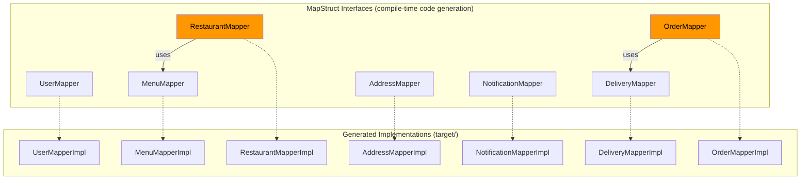

# 🗃️ PHẦN 6 — DATA ACCESS & OBJECT MAPPING

---

## 6.1. Repository Architecture

```mermaid
graph TD
    JPA["JpaRepository&lt;T, Long&gt;<br/>(Spring Data JPA)"]
    
    JPA --> USER_REPO["UserRepository"]
    JPA --> ADDR_REPO["AddressRepository"]
    JPA --> REST_REPO["RestaurantRepository"]
    JPA --> RCAT_REPO["RestaurantCategoryRepository"]
    JPA --> MCAT_REPO["MenuCategoryRepository"]
    JPA --> MITEM_REPO["MenuItemRepository"]
    JPA --> ORDER_REPO["OrderRepository"]
    JPA --> OITEM_REPO["OrderItemRepository"]
    JPA --> OSH_REPO["OrderStatusHistoryRepository"]
    JPA --> DA_REPO["DeliveryAssignmentRepository"]
    JPA --> SL_REPO["ShipperLocationRepository"]
    JPA --> NOTIF_REPO["NotificationRepository"]
    JPA --> OREQ_REPO["OwnerRequestRepository"]
    JPA --> SREQ_REPO["ShipperRequestRepository"]

    style ORDER_REPO fill:#ff9800,color:#000
    style REST_REPO fill:#ff9800,color:#000
    style DA_REPO fill:#ff9800,color:#000
```

Tất cả 14 repository interfaces kế thừa `JpaRepository<Entity, Long>`, cung cấp CRUD cơ bản + custom queries:



> Highlighted: Repositories với custom queries phức tạp nhất.

---

## 6.2. Chi tiết từng Repository

### 6.2.1. `OrderRepository` — Phức tạp nhất

[OrderRepository.java](file:///c:/Users/bachp/Downloads/Mini-Food-Delivery/SRC/backend/src/main/java/com/example/server/repository/OrderRepository.java)

| Method | Type | Purpose |
|:-------|:-----|:--------|
| `findByUserIdOrderByCreatedAtDesc(userId, pageable)` | Derived + `@EntityGraph` | Lịch sử đơn hàng (eager load restaurant) |
| `findById(id)` | Override + `@EntityGraph` | Load đầy đủ graph: user, restaurant, items, histories, assignment |
| `findDeliveredOrdersForReport(start, end)` | `@Query` JPQL | Đơn DELIVERED trong khoảng thời gian |
| `findByRestaurantIdAndStatus(restaurantId, status)` | Derived + `@EntityGraph` | Đơn của nhà hàng (eager load user, restaurant) |
| `findAvailableOrdersNearLocation(lat, lng, radius)` | `@Query` **Native SQL** | Haversine formula |
| `updateOrderStatus(orderId, status)` | `@Modifying` `@Query` | Bulk update (bypass entity) |
| `countDeliveredOrders(start, end)` | `@Query` aggregate | COUNT cho reports |
| `sumTotalRevenue(start, end)` | `@Query` aggregate | SUM cho reports |
| `findRestaurantRevenue(start, end)` | `@Query` aggregate | GROUP BY restaurant |

#### 🌍 Haversine Formula — Native SQL

```sql
SELECT o.*, (
    6371 * acos(
        cos(radians(:lat)) * cos(radians(o.delivery_lat)) *
        cos(radians(o.delivery_lng) - radians(:lng)) +
        sin(radians(:lat)) * sin(radians(o.delivery_lat))
    )
) AS distance
FROM orders o
WHERE o.status = 'READY'
HAVING distance < :radius
ORDER BY distance ASC
```

> Tính khoảng cách (km) giữa vị trí shipper `(:lat, :lng)` và điểm giao `(delivery_lat, delivery_lng)` sử dụng bán kính Trái Đất = 6371 km.

#### 📊 Revenue Report — GROUP BY Query

```sql
SELECT o.restaurant.id, o.restaurant.name, COUNT(o.id), SUM(o.totalAmount)
FROM Order o
WHERE o.status = 'DELIVERED' AND o.createdAt BETWEEN :start AND :end
GROUP BY o.restaurant.id, o.restaurant.name
```

Returns `List<Object[]>` — mỗi phần tử: `[restaurantId, restaurantName, orderCount, totalRevenue]`

#### `@EntityGraph` — Eager Loading Strategy

```java
// Tránh N+1 query problem
@EntityGraph(attributePaths = {"user", "restaurant", "orderItems", 
                                "statusHistories", "deliveryAssignment"})
Optional<Order> findById(Long id);  // Overrides JpaRepository default
```

> Một lần gọi `findById()` sẽ JOIN fetch **5 associations** thay vì 5 lazy-loading queries riêng lẻ.

---

### 6.2.2. `RestaurantRepository`

[RestaurantRepository.java](file:///c:/Users/bachp/Downloads/Mini-Food-Delivery/SRC/backend/src/main/java/com/example/server/repository/RestaurantRepository.java)

| Method | Type | Purpose |
|:-------|:-----|:--------|
| `searchRestaurants(keywords, categoryId, pageable)` | `@Query` + `@EntityGraph` | Dynamic search với nullable filters |
| `findById(id)` | Override + `@EntityGraph` | Eager load category + owner |
| `findByIsApprovedFalse(pageable)` | Derived | Admin: pending restaurants (paginated) |
| `findByIsApprovedFalseAndIsDeletedFalse()` | Derived + `@EntityGraph` | Admin: pending & not deleted |
| `approveRestaurant(id)` | `@Modifying` `@Query` | Direct UPDATE (bypass entity) |
| `findByOwnerId(ownerId)` | Derived + `@EntityGraph` | Owner's restaurants |
| `countByIsApprovedTrue()` | Derived count | Report statistics |

---

### 6.2.3. `DeliveryAssignmentRepository`

| Method | Purpose |
|:-------|:--------|
| `findByOrderId(orderId)` | Tìm assignment cho 1 đơn hàng |
| `findByShipperIdAndStatusIn(shipperId, statuses)` | Assignments active cho shipper |
| `findAllByShipperIsNullAndStatus("UNASSIGNED")` | Pool đơn chờ nhận |
| `findAllByShipperId(shipperId)` | Tất cả assignments của shipper |

---

### 6.2.4. `NotificationRepository`

| Method | Type | Purpose |
|:-------|:-----|:--------|
| `findByUserIdOrderByCreatedAtDesc(userId)` | Derived | Danh sách thông báo mới nhất trước |
| `markAllAsRead(userId)` | `@Modifying` `@Query` | Bulk: tất cả → is_read = true |
| `markAllByTypeAsRead(userId, type)` | `@Modifying` `@Query` | Bulk: theo type → is_read = true |

---

### 6.2.5. Các Repository đơn giản

| Repository | Custom Methods | Notes |
|:-----------|:--------------|:------|
| `UserRepository` | `findByEmail()`, `existsByEmail()`, `findByRoleAndActiveTrue()` | Auth + reports |
| `AddressRepository` | `findByUserId()`, `findByUserIdAndIsDefaultTrue()` | User addresses |
| `MenuCategoryRepository` | `findByRestaurantIdOrderBySortOrderAsc()` | Sorted menu structure |
| `MenuItemRepository` | `findBrowseItems()` (JPQL join) | Public browsing |
| `OrderStatusHistoryRepository` | `findByOrderIdOrderByCreatedAtDesc()` | Audit trail |
| `ShipperLocationRepository` | `findByShipperId()`, `updateOnlineStatus()` | Real-time tracking |
| `OwnerRequestRepository` | `findByStatus()`, `findByUserId()` | Workflow queries |
| `ShipperRequestRepository` | `findByStatus()`, `findByUserId()` | Workflow queries |
| `OrderItemRepository` | — (CRUD only) | Managed via Order cascade |
| `RestaurantCategoryRepository` | — (CRUD only) | Global category list |

---

## 6.3. MapStruct Mappers — Entity ↔ DTO Conversion

### 6.3.1. Mapper Architecture



### 6.3.2. OrderMapper — Phức tạp nhất

[OrderMapper.java](file:///c:/Users/bachp/Downloads/Mini-Food-Delivery/SRC/backend/src/main/java/com/example/server/mapper/OrderMapper.java)

```java
@Mapper(componentModel = "spring", uses = {DeliveryMapper.class})
public interface OrderMapper {
    
    // Order → OrderSummaryResponse
    @Mapping(target = "userId",         source = "user.id")
    @Mapping(target = "restaurantId",   source = "restaurant.id")
    @Mapping(target = "restaurantName", source = "restaurant.name")
    OrderSummaryResponse toSummaryResponse(Order order);

    // OrderItem → OrderItemResponse
    @Mapping(target = "menuItemId", source = "menuItem.id")
    @Mapping(target = "itemName",   source = "menuItem.name")
    @Mapping(target = "itemPrice",  source = "menuItem.price")
    OrderItemResponse toItemResponse(OrderItem orderItem);

    // Order → OrderTrackingResponse (rich object)
    @Mapping(target = "orderId",    source = "id")
    @Mapping(target = "timeline",   source = "statusHistories")
    @Mapping(target = "assignment", source = "deliveryAssignment")
    OrderTrackingResponse toTrackingResponse(Order order);

    // OrderStatusHistory → OrderStatusHistoryResponse
    @Mapping(target = "orderId",       source = "order.id")
    @Mapping(target = "changedByUserId", source = "changedBy.id")
    @Mapping(target = "changedByName",   source = "changedBy.fullName")
    OrderStatusHistoryResponse toStatusHistoryResponse(OrderStatusHistory history);
}
```

> `uses = {DeliveryMapper.class}` — OrderMapper tự động gọi DeliveryMapper khi mapping `deliveryAssignment` field.

### 6.3.3. RestaurantMapper — Bidirectional + Update

[RestaurantMapper.java](file:///c:/Users/bachp/Downloads/Mini-Food-Delivery/SRC/backend/src/main/java/com/example/server/mapper/RestaurantMapper.java)

```java
@Mapper(componentModel = "spring", uses = {MenuMapper.class})
public interface RestaurantMapper {
    
    // Entity → Card (search results)
    @Mapping(target = "categoryName", source = "category.name")
    RestaurantCardResponse toCardResponse(Restaurant restaurant);

    // Entity → Detail (full view with menu)
    @Mapping(target = "ownerId",      source = "owner.id")
    @Mapping(target = "categoryId",   source = "category.id")
    @Mapping(target = "categoryName", source = "category.name")
    RestaurantDetailResponse toDetailResponse(Restaurant restaurant);

    // Request → Entity (create)
    @Mapping(target = "id", ignore = true)
    @Mapping(target = "owner", ignore = true)
    @Mapping(target = "category", ignore = true)
    // ... 7 more ignores for managed fields
    Restaurant toEntity(RestaurantRequest request);

    // Request → Entity (update existing)
    @Mapping(target = "id", ignore = true)
    // ... same ignores
    void updateEntity(@MappingTarget Restaurant restaurant, RestaurantRequest request);
}
```

> [!TIP]
> `@MappingTarget` trong `updateEntity()` — MapStruct modifies the existing entity in-place thay vì tạo mới. Các field `ignore = true` giữ nguyên giá trị cũ (id, owner, timestamps, etc.)

### 6.3.4. Mapper Summary Table

| Mapper | Input → Output | Special Features |
|:-------|:--------------|:-----------------|
| **UserMapper** | `User → UserProfileResponse` | Simple field mapping |
| **RestaurantMapper** | `Restaurant ↔ CardResponse / DetailResponse / Request` | `uses = MenuMapper`, `@MappingTarget` update |
| **OrderMapper** | `Order → SummaryResponse / TrackingResponse` | `uses = DeliveryMapper`, recursive mapping |
| **DeliveryMapper** | `DeliveryAssignment → AssignmentResponse`, `ShipperLocation → LocationResponse` | Used by OrderMapper |
| **MenuMapper** | `MenuItem ↔ ItemResponse / ItemRequest`, `MenuCategory → CategoryResponse` | Category + item mapping |
| **AddressMapper** | `Address ↔ AddressRequest / AddressResponse` | Bidirectional |
| **NotificationMapper** | `Notification → NotificationResponse` | Simple mapping |

---

## 6.4. DTO Organization

```
dto/
├── auth/
│   ├── LoginRequest.java
│   ├── RegisterRequest.java
│   └── JwtResponse.java
├── common/
│   ├── ApiResponse.java          ← Generic wrapper
│   └── PageResponse.java         ← Pagination wrapper
├── delivery/
│   ├── AssignShipperRequest.java
│   ├── DeliveryAssignmentResponse.java
│   ├── MarkDeliveredRequest.java
│   ├── MarkPickupRequest.java
│   ├── ShipperLocationDTO.java   ← WebSocket payload
│   ├── ShipperLocationResponse.java
│   └── ShipperLocationUpdateRequest.java
├── map/
│   ├── RoutingResponse.java
│   └── SearchResult.java
├── notification/
│   ├── MarkAllNotificationsReadRequest.java
│   ├── MarkNotificationReadRequest.java
│   └── NotificationResponse.java
├── order/
│   ├── CreateOrderItemRequest.java
│   ├── CreateOrderRequest.java
│   ├── OrderItemResponse.java
│   ├── OrderStatusHistoryResponse.java
│   ├── OrderStatusUpdateRequest.java
│   ├── OrderSummaryResponse.java
│   └── OrderTrackingResponse.java
├── owner/
│   ├── OwnerRequestApproval.java
│   ├── OwnerRequestResponse.java
│   └── OwnerRequestSubmission.java
├── report/
│   ├── AdminReportSummaryResponse.java
│   └── RestaurantRevenueResponse.java
├── restaurant/
│   ├── RestaurantCardResponse.java
│   ├── RestaurantDetailResponse.java
│   ├── RestaurantRequest.java
│   └── RestaurantSearchRequest.java
├── shipper/
│   ├── ShipperRequestApproval.java
│   ├── ShipperRequestResponse.java
│   └── ShipperRequestSubmission.java
└── user/
    ├── AddressRequest.java
    ├── AddressResponse.java
    ├── AdminStatsResponse.java
    ├── RestaurantApprovalRequest.java
    ├── UserProfileResponse.java
    ├── UserProfileUpdateRequest.java
    ├── UserRoleUpdateRequest.java
    └── UserStatusUpdateRequest.java
```

> Tổng cộng **~40 DTO classes**, tổ chức theo domain boundary.

---

## 6.5. Key Design Patterns

### 6.5.1. `@EntityGraph` — N+1 Prevention

```java
// WITHOUT EntityGraph: 1 query (Order) + N queries (Restaurant for each order)
Page<Order> findByUserIdOrderByCreatedAtDesc(userId, pageable);

// WITH EntityGraph: 1 JOIN query
@EntityGraph(attributePaths = {"restaurant"})
Page<Order> findByUserIdOrderByCreatedAtDesc(userId, pageable);
```

### 6.5.2. `@Modifying` + `@Query` — Bulk Operations

```java
// Direct SQL UPDATE — bypasses entity lifecycle, much faster for bulk ops
@Modifying
@Query("UPDATE Notification n SET n.isRead = true WHERE n.user.id = :userId")
void markAllAsRead(@Param("userId") Long userId);
```

### 6.5.3. Derived Query Methods

Spring Data JPA tự động generate implementation từ method name:

```java
findByEmail(String email)                    → WHERE email = ?
existsByEmail(String email)                  → SELECT COUNT(*) > 0
findByRoleAndActiveTrue(String role)         → WHERE role = ? AND is_active = TRUE
findByUserIdAndIsDefaultTrue(Long userId)    → WHERE user_id = ? AND is_default = TRUE
findByRestaurantIdOrderBySortOrderAsc(Long)  → WHERE restaurant_id = ? ORDER BY sort_order ASC
findByIsApprovedFalseAndIsDeletedFalse()     → WHERE is_approved = FALSE AND is_deleted = FALSE
```

### 6.5.4. `ObjectProvider<T>` — Conditional Bean Resolution

```java
// In ServerApplication — beans might not exist in Smoke Mode
@Bean CommandLineRunner runner(
    ObjectProvider<UserRepository> userRepositoryProvider,
    ObjectProvider<DataSource> dataSourceProvider) {
    
    dataSourceProvider.ifAvailable(dataSource -> { ... });
    // No exception if bean is missing — graceful degradation
}
```
