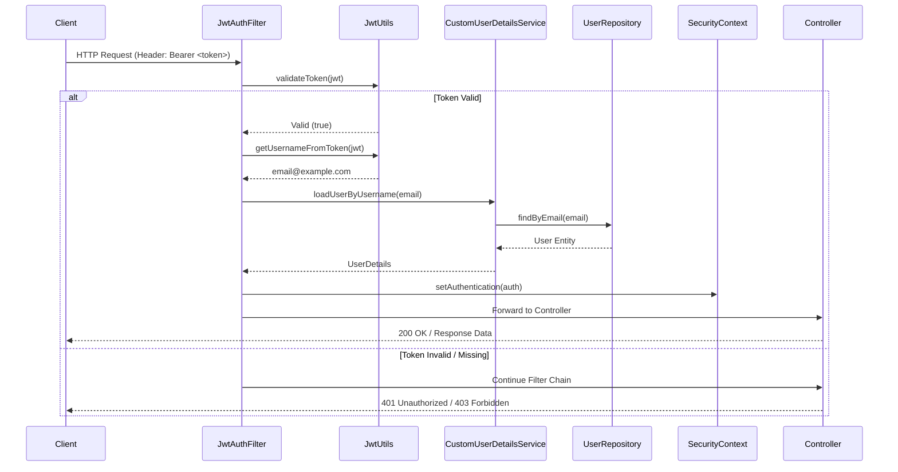

# Configuration and Security Analysis

This document explains the infrastructure, security, and configuration of the Mini Food Delivery backend.

## 1. Security Flow (JWT Authentication)

The following sequence diagram illustrates how incoming requests are intercepted, validated, and authorized by the Spring Security filter chain.

## 2. Spring Configuration
- **SecurityConfig:** Centralizes security rules. Configures stateless session management, CSRF disabling, and CORS. Defines the `SecurityFilterChain` with path-based authorization.
- **WebConfig:** Global CORS configuration for the MVC layer.
- **WebSocketConfig:** Enables STOMP-based WebSocket messaging. Defines `/ws` as the endpoint and `/topic` as the broker prefix.
- **OpenApiConfig:** Configures Swagger/OpenAPI documentation with JWT Bearer Auth support.
- **MapClientConfig:** Configures a `RestClient` bean with a custom User-Agent for external API calls.

## 2. Security Implementation (JWT & RBAC)
- **JwtUtils:** Utility for generating, parsing, and validating JSON Web Tokens using `io.jsonwebtoken`.
- **JwtAuthFilter:** A `OncePerRequestFilter` that intercepts every request, extracts the JWT, validates it, and sets the `SecurityContext` if valid.
- **CustomUserDetails / CustomUserDetailsService:** Bridges the JPA `User` entity with Spring Security's `UserDetails` interface. Correctly prefixes roles with `ROLE_`.
- **RBAC:** Access is controlled via `@PreAuthorize` annotations on controllers and path matchers in `SecurityConfig`.

## 3. Event Handling
- **OrderReadyEvent:** A custom `ApplicationEvent` published when an order status reaches `READY`.
- **OrderEventListener:** 
    - Uses `@TransactionalEventListener` with `TransactionPhase.AFTER_COMMIT` to ensure delivery logic only runs if the order status update is successfully persisted.
    - Uses `Propagation.REQUIRES_NEW` to run delivery assignment in a separate transaction.
    - Triggers `deliveryService.createUnassignedAssignment`.

## 4. Exception Handling
- **AppException:** A generic runtime exception for business logic errors, including a `HttpStatus` and a custom `errorCode`.
- **ResourceNotFoundException:** Specifically for missing database entities.
- **GlobalExceptionHandler:** A `@ControllerAdvice` that transforms various exceptions (Validation, ResourceNotFound, AccessDenied) into a consistent `ApiResponse` format for the frontend.

## 5. Main Application Class (`ServerApplication`)
- **Dotenv Integration:** Manages environment variables using `cdimascio.dotenv`. Automatically loads `.env` from multiple potential locations.
- **Smoke Mode:** Features a special "Smoke Mode" that can disable DB/JPA auto-configuration for quick testing of non-database components.
- **CommandLineRunner:** Performs a system health check on startup, verifying database connectivity and reporting the number of registered users.
