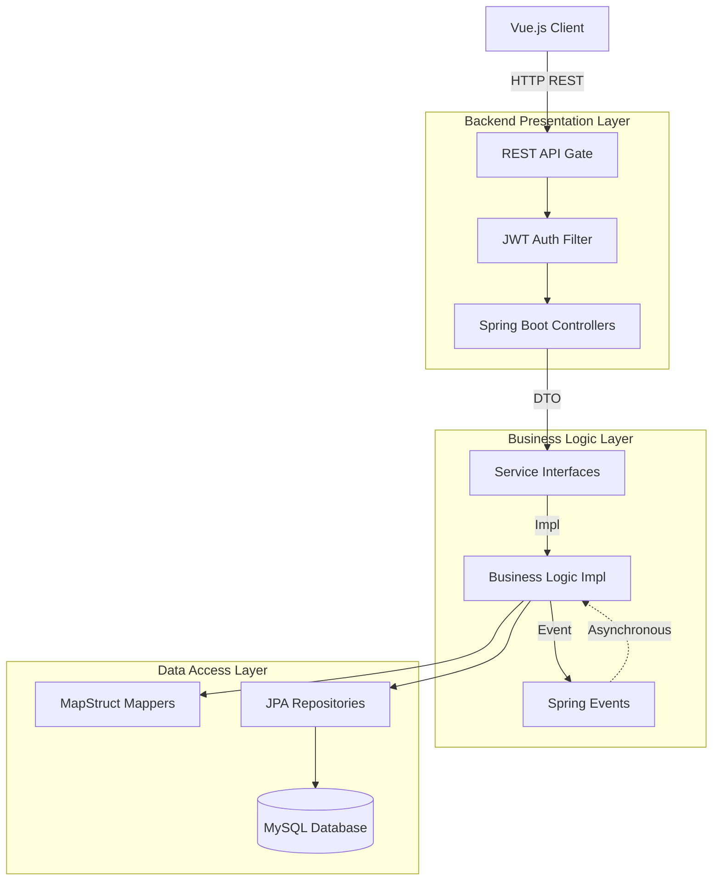

# REST Controllers Analysis

This document provides a comprehensive overview of the REST Controllers in the Mini Food Delivery backend system.

## 1. System Architecture & Routing Flow

The diagram below shows the high-level architecture of how client requests are routed through the backend layers.

## 2. AdminController
- **Base Path:** `/api/admin`
- **Purpose:** Handles administrative operations including system statistics, user management, restaurant approval, and report generation.
- **Security:** Requires `ROLE_ADMIN`.
- **Endpoints:**
    - `GET /stats`: Retrieves system-wide statistics (total users, restaurants, orders, revenue).
    - `GET /users`: Retrieves a list of all user profiles.
    - `GET /restaurants/pending`: Retrieves restaurants awaiting approval.
    - `POST /restaurants/{id}/approve`: Approves or rejects a restaurant application.
    - `PATCH /users/{id}/role`: Updates a user's role (prevents self-demotion).
    - `PATCH /users/{id}/status`: Updates a user's active status (prevents self-deactivation).
    - `DELETE /users/{id}`: Deletes a user account (prevents self-deletion).
    - `GET /reports/summary`: Generates an administrative report summary for a date range.
    - `GET /reports/restaurants`: Retrieves revenue reports categorized by restaurant.
    - `GET /reports/export/csv`: Exports revenue data as a CSV file.

## 2. AuthController
- **Base Path:** `/api/auth`
- **Purpose:** Manages user authentication and registration.
- **Security:** Public access.
- **Endpoints:**
    - `POST /login`: Authenticates a user and returns a JWT.
    - `POST /register`: Registers a new customer and returns a JWT.

## 3. DeliveryController
- **Base Path:** `/api/deliveries`
- **Purpose:** Manages delivery assignments, shipper tracking, and status updates.
- **Security:** Various (Admin, Shipper, Authenticated).
- **Endpoints:**
    - `POST /assign`: Assigns a shipper to an order (`ADMIN` or `SHIPPER`).
    - `PATCH /{orderId}/pickup`: Marks an order as picked up by the shipper.
    - `PATCH /{orderId}/deliver`: Marks an order as delivered.
    - `PUT /location`: Updates the shipper's current geographic location.
    - `GET /{shipperId}/location`: Retrieves the last known location of a shipper.
    - `GET /available`: Lists all delivery assignments currently unassigned.
    - `GET /my`: Retrieves delivery assignments for the authenticated shipper.
    - `GET /order/{orderId}`: Retrieves delivery details for a specific order.

## 4. MapController
- **Base Path:** `/api/public/map`
- **Purpose:** Provides geocoding and routing services using external map providers.
- **Security:** Public access.
- **Endpoints:**
    - `GET /search`: Searches for addresses based on a query string.
    - `GET /route`: Calculates distance, duration, and geometry for a route between two coordinates.

## 5. MenuController
- **Base Path:** `/api/restaurants/{restaurantId}/menu`
- **Purpose:** Manages menu categories and items within a restaurant.
- **Security:** Public for reading, `ROLE_OWNER` for modifications.
- **Endpoints:**
    - `GET /categories`: Lists all menu categories for a restaurant.
    - `POST /categories`: Adds a new menu category.
    - `PUT /categories/{categoryId}`: Updates an existing menu category.
    - `DELETE /categories/{categoryId}`: Deletes a menu category.
    - `POST /categories/{categoryId}/items`: Adds a menu item to a category.
    - `PUT /items/{itemId}`: Updates a menu item's details.
    - `DELETE /items/{itemId}`: Deletes a menu item.
    - `GET /items/{itemId}`: Retrieves details for a specific menu item.

## 6. OrderController
- **Base Path:** `/api/orders`
- **Purpose:** Handles order creation, history, tracking, and status management.
- **Security:** Various (Customer, Owner, Admin).
- **Endpoints:**
    - `POST /`: Creates a new order (`ROLE_CUSTOMER`).
    - `GET /{id}`: Retrieves a summary of a specific order.
    - `GET /history`: Retrieves the paginated order history for the authenticated user.
    - `PATCH /{id}/status`: Updates the status of an order (e.g., CONFIRMED, PREPARING).
    - `GET /{id}/tracking`: Retrieves real-time tracking information including status timeline and delivery assignment.
    - `GET /restaurant/{restaurantId}`: Retrieves orders for a specific restaurant (filtered by status).

## 7. OwnerRequestController
- **Base Path:** `/api/owner-requests`
- **Purpose:** Manages user requests to become restaurant owners.
- **Security:** Authenticated for submission, `ROLE_ADMIN` for processing.
- **Endpoints:**
    - `POST /`: Submits a new owner request.
    - `GET /my`: Retrieves requests submitted by the authenticated user.
    - `GET /pending`: Lists all pending owner requests for admin review.
    - `PUT /{id}/process`: Approves or rejects an owner request.

## 8. RestaurantController
- **Base Path:** `/api/restaurants`
- **Purpose:** Handles restaurant search, detail retrieval, and management by owners.
- **Security:** Public for searching, `ROLE_OWNER` for management.
- **Endpoints:**
    - `POST /search`: Searches for restaurants with pagination and filters (category, keyword).
    - `GET /{id}`: Retrieves detailed information about a restaurant, including its menu.
    - `GET /my-restaurants`: Lists restaurants owned by the authenticated user.
    - `POST /`: Creates a new restaurant profile.
    - `PUT /{id}`: Updates restaurant details.
    - `DELETE /{id}`: Performs a logical delete of a restaurant.

## 9. RestaurantCategoryController
- **Base Path:** `/api/restaurant-categories`
- **Purpose:** Provides a list of available restaurant categories.
- **Security:** Public access.
- **Endpoints:**
    - `GET /`: Retrieves all restaurant categories.

## 10. ShipperRequestController
- **Base Path:** `/api/shipper-requests`
- **Purpose:** Manages user requests to become shippers.
- **Security:** Authenticated for submission, `ROLE_ADMIN` for processing.
- **Endpoints:**
    - `POST /`: Submits a new shipper request.
    - `GET /my`: Retrieves requests submitted by the authenticated user.
    - `GET /pending`: Lists all pending shipper requests for admin review.
    - `PUT /{id}/process`: Approves or rejects a shipper request.

## 11. UserController
- **Base Path:** `/api/users`
- **Purpose:** Manages user profiles, addresses, and notifications.
- **Security:** Authenticated access.
- **Endpoints:**
    - `GET /me`: Retrieves the authenticated user's profile.
    - `PUT /me`: Updates profile information.
    - `DELETE /me`: Deletes the user's account.
    - `GET /me/addresses`: Lists the user's saved addresses.
    - `POST /me/addresses`: Adds a new address.
    - `PUT /me/addresses/{id}`: Updates an existing address.
    - `DELETE /me/addresses/{id}`: Deletes an address.
    - `PATCH /me/addresses/{id}/default`: Sets an address as the default.
    - `GET /me/notifications`: Retrieves user notifications.
    - `PATCH /me/notifications/read`: Marks a specific notification as read.
    - `PATCH /me/notifications/read-all`: Marks all notifications of a certain type as read.

## 12. LocationWebSocketController
- **Purpose:** Handles real-time shipper location updates via WebSocket.
- **Message Mapping:**
    - `/app/shipper/location`: Receives location updates from shippers and broadcasts them to subscribers of `/topic/order/{orderId}`.
- **Interactions:** Persists location to `ShipperLocationRepository` and updates DB status.

## 13. DevController
- **Base Path:** `/api/dev`
- **Purpose:** Development-only tools for database management.
- **Profile:** `dev`.
- **Endpoints:**
    - `POST /db/reset`: Cleans and re-migrates the database using Flyway.
