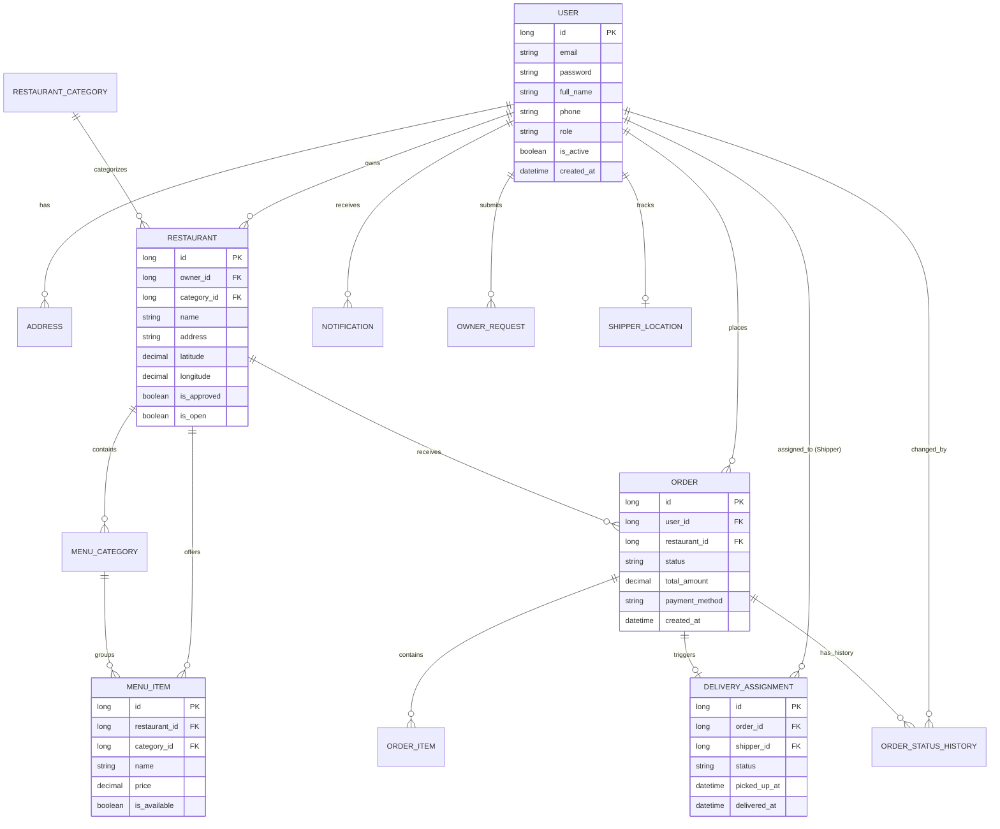

# Models and DTOs Analysis

This document provides a detailed breakdown of the data models (Entities), Data Transfer Objects (DTOs), Enums, and Mappers.

## 1. Entity Relationship Diagram (ERD)

The following diagram illustrates the core entities and their complex relationships within the Mini Food Delivery system.

## 2. Entities (JPA Mappings)
The system uses JPA for ORM. All entities include lifecycle hooks (`@PrePersist`, `@PreUpdate`) for timestamp management.

- **User:** Root entity for all actors. Stores credentials, profile data, and role. Has `@OneToMany` relationships with Address, Order, Restaurant, Notification, etc.
- **Restaurant:** Stores restaurant metadata, location, and operating hours. Linked to an `Owner` (User) and a `RestaurantCategory`.
- **MenuItem:** Represents a food item. Linked to `Restaurant` and `MenuCategory`.
- **Order:** Core transaction entity. Stores delivery address, totals, and status. Linked to `User` and `Restaurant`.
- **OrderItem:** Snapshot of a `MenuItem` at the time of order (stores price and name to prevent historical changes from affecting old orders).
- **DeliveryAssignment:** Manages the link between an `Order` and a `Shipper`.
- **Address:** User-saved locations for delivery.
- **Notification:** System alerts for users.
- **OwnerRequest / ShipperRequest:** Formal applications for role upgrades.
- **ShipperLocation:** Tracks real-time latitude/longitude for active shippers.

## 2. Data Transfer Objects (DTOs)
DTOs are used to decouple the API from the database schema and enforce validation.

### Auth DTOs
- `LoginRequest` / `RegisterRequest`: Input validation for auth endpoints.
- `JwtResponse`: Payload containing the token and user metadata.

### User DTOs
- `UserProfileResponse`: Detailed view of user account.
- `AddressRequest` / `AddressResponse`: CRUD payloads for addresses.

### Restaurant DTOs
- `RestaurantSearchRequest`: Parameters for filtering and pagination.
- `RestaurantCardResponse`: Simplified view for search results.
- `RestaurantDetailResponse`: Exhaustive view including the full menu.

### Order DTOs
- `CreateOrderRequest`: Nested structure including multiple `CreateOrderItemRequest`.
- `OrderSummaryResponse`: High-level view for history lists.
- `OrderTrackingResponse`: Rich object containing the status timeline and delivery data.

### Report DTOs
- `AdminReportSummaryResponse`: Aggregated stats for date ranges.
- `RestaurantRevenueResponse`: Grouped revenue data.

## 3. Enums
- **Role:** `CUSTOMER`, `SHIPPER`, `OWNER`, `ADMIN`.
- **OrderStatus:** `PENDING`, `CONFIRMED`, `PREPARING`, `READY`, `SHIPPING`, `DELIVERED`, `REJECTED`, `CANCELLED`.
- **OwnerRequestStatus / ShipperRequestStatus:** `PENDING`, `APPROVED`, `REJECTED`.
- **DeliveryAssignmentStatus:** `UNASSIGNED`, `ASSIGNED`, `PICKED_UP`, `DELIVERED`.

## 4. MapStruct Mappers
The project uses MapStruct for efficient, type-safe mapping between Entities and DTOs.

- **UserMapper:** Maps `User` to `UserProfileResponse`.
- **RestaurantMapper:** Handles complex mapping between `Restaurant` and its Detail/Card responses.
- **OrderMapper:** Maps `Order` to `OrderSummaryResponse` and `OrderTrackingResponse`. Recursively uses `DeliveryMapper`.
- **MenuMapper:** Maps categories and items.
- **AddressMapper:** Simplifies address entity/DTO conversion.
- **DeliveryMapper:** Specifically handles `DeliveryAssignment` and `ShipperLocation`.
- **NotificationMapper:** Maps `Notification` entities.
