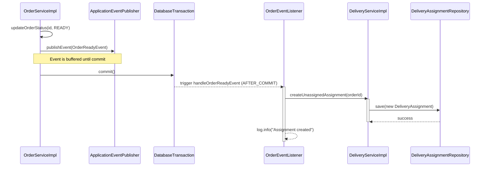

# Service Layer Analysis

This document provides a comprehensive analysis of the service interfaces and their implementations in the Mini Food Delivery backend.

## 1. Event-Driven Workflow (Order to Delivery)

The system uses an asynchronous, decoupled event-driven approach to transition an order from the "Ready" state to the "Delivery Assignment" phase.

## 2. AdminService (`AdminServiceImpl`)
- **Purpose:** Orchestrates high-level administrative tasks.
- **Key Methods:**
    - `approveRestaurant`: Updates restaurant approval status and sends a notification to the owner.
    - `updateUserRole/Status`: Delegates to `UserService`.
    - `getSystemStats`: Aggregates data from multiple repositories (User, Restaurant, Order) to provide a system health overview.
- **Dependencies:** `RestaurantRepository`, `UserRepository`, `OrderRepository`, `UserService`, `NotificationService`, `UserMapper`, `RestaurantMapper`.
- **Transactions:** Uses `@Transactional` for status/role updates.

## 2. AuthService (`AuthServiceImpl`)
- **Purpose:** Manages authentication and user registration.
- **Key Methods:**
    - `login`: Uses Spring Security `AuthenticationManager` to verify credentials and `JwtUtils` to generate a token.
    - `register`: Creates a new user with `ROLE_CUSTOMER`, hashes the password, and returns a token.
- **Dependencies:** `AuthenticationManager`, `UserRepository`, `PasswordEncoder`, `JwtUtils`.
- **Transactions:** Registration is transactional.

## 3. DeliveryService (`DeliveryServiceImpl`)
- **Purpose:** Manages the lifecycle of a delivery assignment.
- **Key Methods:**
    - `createUnassignedAssignment`: Creates a new entry in `delivery_assignments` for a ready order.
    - `assignShipper`: Links a shipper to an unassigned delivery.
    - `markPickedUp/Delivered`: Updates delivery timestamps and order status.
    - `updateLocation`: Updates real-time geographic coordinates for a shipper.
- **Dependencies:** `DeliveryAssignmentRepository`, `OrderRepository`, `UserRepository`, `ShipperLocationRepository`, `DeliveryMapper`, `OrderService`.
- **Transactions:** Heavy use of `@Transactional` for state consistency.

## 4. MapService (`MapServiceImpl`)
- **Purpose:** Interfaces with external Map APIs (via `RestClient`).
- **Key Methods:**
    - `searchAddress`: Performs geocoding searches.
    - `getRoute`: Fetches routing data (distance, duration, geometry).
- **Dependencies:** `RestClient`.
- **Design:** Acts as a gateway to external services.

## 5. MenuService (`MenuServiceImpl`)
- **Purpose:** Manages restaurant-specific menu structure.
- **Key Methods:**
    - `add/update/deleteMenuCategory`: Manages categories with ownership validation.
    - `add/update/deleteMenuItem`: Manages menu items within categories.
- **Dependencies:** `MenuCategoryRepository`, `MenuItemRepository`, `RestaurantRepository`, `MenuMapper`.
- **Transactions:** Modifications are transactional.

## 6. NotificationService (`NotificationServiceImpl`)
- **Purpose:** Handles internal system notifications for users.
- **Key Methods:**
    - `createNotification`: Persists a new notification for a specific user.
    - `markAsRead/markAllAsRead`: Updates notification status.
- **Dependencies:** `NotificationRepository`, `NotificationMapper`.
- **Transactions:** Reads/writes are managed via `@Transactional`.

## 7. OrderService (`OrderServiceImpl`)
- **Purpose:** The core business logic service for order management.
- **Key Methods:**
    - `createOrder`: Complex logic involving restaurant verification, price calculation, item persistence, and initial history recording.
    - `updateOrderStatus`: Manages state transitions (PENDING -> CONFIRMED -> PREPARING -> READY -> SHIPPING -> DELIVERED).
    - `getOrderTracking`: Aggregates status history and delivery assignment for the client.
- **Dependencies:** `OrderRepository`, `OrderItemRepository`, `OrderStatusHistoryRepository`, `RestaurantRepository`, `UserRepository`, `MenuItemRepository`, `OrderMapper`, `ApplicationEventPublisher`.
- **Transactions:** `createOrder` and `updateOrderStatus` are heavily transactional. Publishes `OrderReadyEvent` when status changes to `READY`.

## 8. OwnerRequestService (`OwnerRequestServiceImpl`)
- **Purpose:** Facilitates the "Become an Owner" workflow.
- **Key Methods:**
    - `submitRequest`: Allows customers to apply for owner status.
    - `processRequest`: Admins approve/reject. Upon approval, automatically promotes the user to `ROLE_OWNER` and creates their `Restaurant` entity.
- **Dependencies:** `OwnerRequestRepository`, `UserRepository`, `RestaurantRepository`.
- **Transactions:** Atomic promotion and restaurant creation.

## 9. ReportService (`ReportServiceImpl`)
- **Purpose:** Generates analytical reports.
- **Key Methods:**
    - `getAdminReport`: Summary of revenue, orders, and active users.
    - `getRestaurantRevenue`: Detailed breakdown of revenue per restaurant.
    - `generateRevenueCsv`: Formats report data into CSV bytes.
- **Dependencies:** `OrderRepository`, `UserRepository`, `RestaurantRepository`.

## 10. RestaurantService (`RestaurantServiceImpl`)
- **Purpose:** Manages restaurant discovery and metadata.
- **Key Methods:**
    - `searchRestaurants`: Complex query handling with filters and pagination.
    - `create/updateRestaurant`: Handles restaurant profile management.
    - `deleteRestaurant`: Logical deletion via `is_deleted` flag.
- **Dependencies:** `RestaurantRepository`, `UserRepository`, `RestaurantCategoryRepository`, `RestaurantMapper`.
- **Transactions:** Writes are transactional.

## 11. ShipperRequestService (`ShipperRequestServiceImpl`)
- **Purpose:** Facilitates the "Become a Shipper" workflow.
- **Key Methods:**
    - `submitRequest`: Customer application for shipper role.
    - `processRequest`: Admin approval. Upon approval, promotes user to `ROLE_SHIPPER` and initializes their `ShipperLocation`.
- **Dependencies:** `ShipperRequestRepository`, `UserRepository`, `ShipperLocationRepository`.

## 12. UserService (`UserServiceImpl`)
- **Purpose:** Core user account and profile management.
- **Key Methods:**
    - `getUserProfile`: Maps user entity to profile response.
    - `add/update/deleteAddress`: Manages user address book with default address logic.
    - `updateUserRole/Status`: Administrative updates to user account.
- **Dependencies:** `UserRepository`, `AddressRepository`, `UserMapper`, `AddressMapper`.
- **Transactions:** Profile and address updates are transactional.
